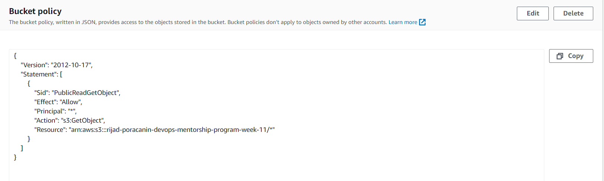
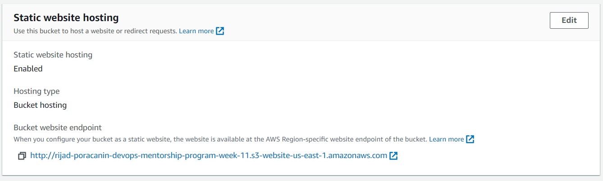
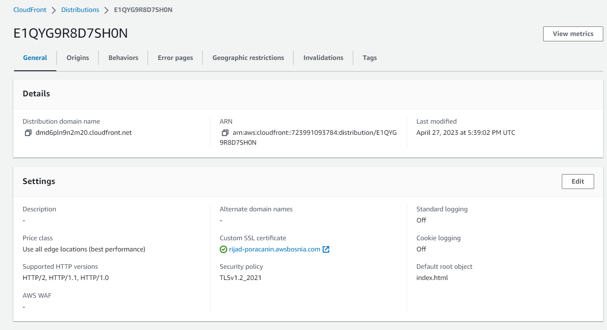
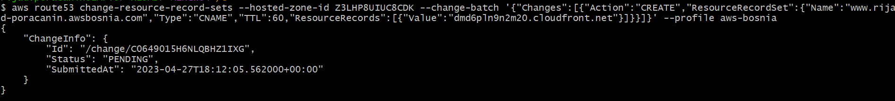
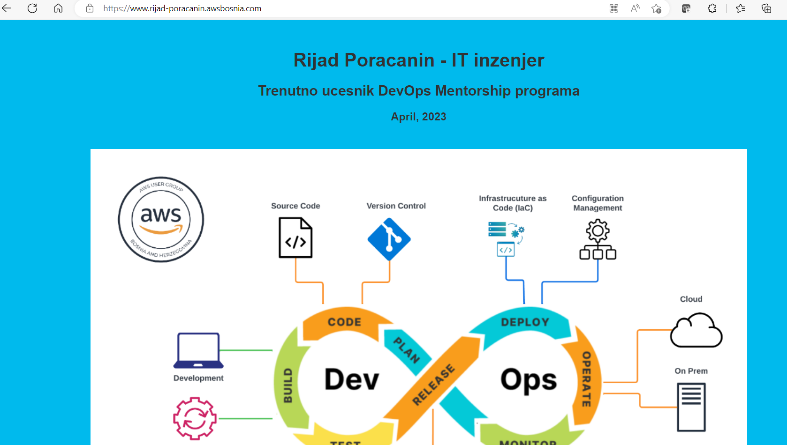

# TASK-9: Static website with S3 and CloudFront

* [ ]  [S3 website endpoint](http://rijad-poracanin-devops-mentorship-program-week-11.s3-website-us-east-1.amazonaws.com/)

* [ ]  [CloudFront Distribution website](https://dmd6pln9n2m20.cloudfront.net/)

* [ ]  [R53 Record](www.rijad-poracanin.awsbosnia.com/)

* [ ] Komanda za konfiguraciju R53: ``aws route53 change-resource-record-sets --hosted-zone-id Z3LHP8UIUC8CDK --change-batch '{"Changes":[{"Action":"CREATE","ResourceRecordSet":{"Name":"www.rijad-poracanin.awsbosnia.com","Type":"CNAME","TTL":60,"ResourceRecords":[{"Value":"dmd6pln9n2m20.cloudfront.net"}]}}]}'``

