# Architecture Deep Dive Part 1

**Monolitna arhitektura** - možemo je zamisliti kao jednu kutiju u kojoj se vrši i upload, i procesiranje i upravljanje i čuvanje
podacima. Problem ovakve arhitekture je što je to sve jedan entitet, i ako jedna komponenta zakaže, to će utjecati na cijeli entitet, odnosno cijela arhitektura će zakazati. 

Još jedan problem monolitne arhitekture je skaliranje, jer se sve skalira zajedno, ne možemo uraditi skaliranje npr. samo za bazu. Dakle, monolitna arhitektura radi skaliranje vertikalno, jer se sve nalazi na jednom komadu hardvera.

I posljednja stavka, koja je jednako važna je cijena, odnosno plaćanje, sve se plaća zajedno. Sve komponente su u statusu running čak i ako se ne koriste većinu vremena,
što povećava troškove.

Dakle, monolitnu arhitekturu je potrebno pretvoriti u **Tiered arhitekturu** (tj. podijeliti je u više slojeva). Tako npr. bazu možemo odvojiti u posebnu RDS instancu.
Prednost Tiered arhitekture je što se komponente mogu zasebno skalirati vertikalno ili horizontalno.

Ipak Tiered arhitektura nije u potpunosti savršena. I dalje su slojevi međusobno povezani. Npr. Upload sloj i dalje mora da komunicira sa Processing slojem, 
pa ako se nešto desi sa Processing slojem, i Upload sloj će zakazati. Također, svaki sloj treba uvijek da ima nešto pokrenuto da bi aplikacija funkcionisala,
što znači da se ne može uraditi skaliranje na nulu.


# Architecture Deep Dive Part 2

Prethodna arhitektura se može unaprijediti koristeći 'queues'. 
**Queue (red)** je sistem koji prihvata poruke. Poruke dolaze u red čekanja i mogu biti primljene ili povućene iz reda.
U većini slučajeva poruke su primljene kao FIFO (First in, first out), ali ovo nije uvijek slučaj.

Sa Queue arhitekturom nema direktne komunikacije, komponente su razdvojene i mogu se skalirati neovisno jedna od druge, i mogu se skalirati od 0 do beskonačno.

**Microservice arhitektura** - To je kolekcija mikroservisa koji veoma dobro rade individualne stvari. Npr. Uplaod, Process, Store i upravljanje mikroservisima. Mikroservis je samodovoljna aplikacija. Ima svoju logiku, ima sopstveno skladište podataka i svoje input i output komponente.

**Event-Driven Architecture** je kolekcija događaja, koji mogu biti komponente vaše aplikacije koje direktno komuniciraju sa korisnicima ili mogu biti dijelovi vaše 
infrastrukture kao što je EC2, ili mogu biti komponente za praćenje sistema.
Najbolje praksa Event Driven Architecture ima tzv. Event Router - visoko dostupan, centralno mjesto za razmjenu događaja. Postoji tzv. event bus, i to možemo posmatrati 
kao mjesto konstantnog toka informacija. Kada se događaj generiše od Producera, on se doda u ovaj event bus, i ruter ga može dostaviti ka  Event Consumeru.

Event-Driven Architecture koristi resurse samo na zahtjev i koliko je potrebno. Dakle, nema konstantnog 'runninga'. Imamo Producere koji generišu događaje kada se 
nešto desi. Dakle, event može generisati klikovi, greške, kada se ispuni neki kriterij, uploadi, i slične akcije.


# AWS  Lambda Part 1

Lambda je FaaS (Function as a service). Lambda funkcija je komad koda kojeg Lambda pokreće, i svaka Lambda funkcija koristi podržani runtime (npr. Python 3.8).

Kada postaviš svoj kod na Lambdi, on se učita i izvrši unutar runtime okruženja.

Plaćaš samo za ono vrijeme koliko traje izvršavanje funkcije.

Lambda je ključni dio Serverless arhitekture.

Lambda funkcije su stateless, što znači da ne ostaju nikakvi podaci prethodne invokacije. Svaki put kada je funkcija pozvana, to je potpuno nova invokacija i potpuno novo okruženje.

Lambda runtime okruženja nemaju state (stanje).

Lambda funkcije mogu da budu pokrenute do 900 sekundi ili 15 minuta. Ako se ovo premaši, to znaci da se Lambda ne može koristiti direktno.

Lambda se može koristiti za:
- Serverless aplikacije (S3, API Gw, Lambda);
- Za file procesiranje (S3, S3 događaji);
- Za trigerovanje baza (DynamoDB, Streams, Lambda);
- Serverless CRON;
- Realtime Stream Data Processing (Kinesis + Lambda);


# AWS  Lambda Part 2

Lambda ima 2 networking moda: 
   - Javni (defaultni) - znači da ima konektivnost do javnih AWS servisa i javnog interneta. Javni networking daje najbolje performanse za Lambdu jer ne zahtijeva
   specijalnu network konfiguraciju. Ali ovo znači da Lambda funkcije koje koriste ovaj defaultni networking nemaju pristup servisima koji su startani unutar VPC-a, 
   osim ako nisu konfigurisani da im se može pristupiti izvan VPC-a. Ovakav vid networkinga se koristi najčešće.
   - VPC networking - Lambda koja se nalazi u VPCu nasljeđuje sve VPC mrežne rulove. Tako da može pristupiti svim resursima unutar VPC-a, ali ne mogu pristupiti stvarima
   izvan VPC-a, osim ako mrežno nije dopušten pristup eksternim servisima. Tako da bi koristio npr. DynamoDB koji se nalazi izvan VPCa, trebamo koristiti Internet Gw, 
   ili ako želimo da Lambda ima izlaz na internet, onda trebamo koristiti NAT Gw i povezati VPC na Internet Gw.
   
Pošto Lambda servis treba da kreira mrežne interfejse unutar našeg VPC-a, moramo da joj damo EC2 mrežne permisije.

**Važan Hint za ispit!** Ako je Lambda unutar VPC-a, tretirajte je kao i bilo koji drugi resurs unutar VPC-a.
   
**Lambda resource policy** - kontroliše koji servisi i računi mogu pozivati Lambda funkcije.

**Lambda execution roles** - to su IAM uloge pridružene lambda funkcijama koje kontorlišu permisije koje Lambda funkcija primi.

Što se tiče logginga i monitoringa, Lambda koristi Cloudwatch, Cloudwatch Logs i X-Ray.

Logovi nakon Lambda izvršenja idu u CloudwatchLogs. CloudwatchLogs zahtjevaju permisije od Execution Role.

Bilo koja metrika, kao što je (invocation success/failure) i sl. ide u Cloudwatch.

Lambda može biti integrisana sa X-Ray - za praćenje korisnika, sesija i sl.


# AWS Lambda Part 3

3 metode pozivanja Lambda funkcije (Invocation): 
- *Sinhrona* - CLI/API poziva funkciju, prosljeđuje podatke i čeka na odgovor. Lambda funkcija odgovara sa podacima;

Klijenti komuniciraju sa API Gw, što se dalje prosljeđuje ka Lambda funckiji, koja šalje odgovor (success ili failure) ka API Gw, koji prosljeđuje odgovor nazad klijentu.

Dakle, sinhrona invokacija se uglavnom koristi kada ljudsko biće direktno ili indirektno poziva Lambda funkciju.
- *Asinhrona* - Najčešće se koristi kada AWS servisi pozivaju lambda funkcije (ne čeka se bilo kakav povratni odgovor, kao u slučaju sinhrone);

Neuspješni događaji se mogu slati u Dead Letter queue.

Lambda podržava destinacije (SQS, SNS, Lambda i EventBridge) gdje se uspješni ili neuspješni događaji mogu slati.
- *Event Source mappings* - najčešće se koristi kod Streams ili queues koji ne generišu događaje da bi pozvali Lambdu (Kinesis, DynamoDB streams, SQS);

Sa Event Source mapping, source servis ne šalje događaj, nego samo čita iz source-a.

Tako da Event Source mapping koristi permisije od Lambda Execution Role da bi pristupio source servisu.
				
**Execution context** - okruženje u kojem Lambda funkcija se starta. 

**Cold start** - potpuno kreiranje i konfiguracija uključujući i download koda.

**Warm start** - Kada se koristi već postojeći Execution context (ne kreira se na novo).


# CloudWatch Events and Event Bridge
	 
**CloudWatch Events** - u stvarnom vremenu nam daje stream sistem događaja i ovi događaji opisuju promjene unutar AWS proizvoda i servisa. Npr. kada se instanca stopira, pokrene ili terminira to generiše event.

**Event Bridge** je servis koji mijenja CloudWatch Evente. Može pružiti sve iste funkcionalnosti kao i CloudWatch Events. Dodatno, može upravljati događajima od aplikacija trećih strana.

Kada se desi neki događaj (npr. pokrene se EC2 instanca), taj događaj dođe u Event Bus, a Event bus komunicira sa Event Bridge-om, koji sadrži razne rulove. 
Kada je rule izvršen, šalje se događaj ka jednom ili više targeta. Taj target može biti Lambda.


# Automated EC2 Control using lambda and events Part 1 (DEMO)

- Kreirao dvije EC2 instance pomoću 'One-click deploymenta' i CloudFormation Stack opcije;
- Kreirao Lambda Execution rolu kojom se Lambdi dozvoljava da piše logove u CloudWatch Logs, i dozvoljava joj se pokretanje/zaustavljanje EC2.
   
 ```json  
   {
  "Version": "2012-10-17",
  "Statement": [
    {
      "Effect": "Allow",
      "Action": [
        "logs:CreateLogGroup",
        "logs:CreateLogStream",
        "logs:PutLogEvents"
      ],
      "Resource": "arn:aws:logs:*:*:*"
    },
    {
      "Effect": "Allow",
      "Action": [
        "ec2:Start*",
        "ec2:Stop*"
      ],
      "Resource": "*"
    }
  ]
}
```

- Onda sam na osnovu ove policy kreiro IAM rolu.
- Kreirao Lambda funkciju 'Ec2Stop'. Izabrao sam Runtime Python 3.9 i ranije kreiranu rolu 'EC2StartStopLambdaRole'.
- Sa kodom ispod smo kreirali funkciju koja prihvata listu EC2 instanci pomoću environment varijable. Ec2 instance koje imamo će biti povezane sa ovom Lambda funkcijom i pozivaće ec2.stop_instances što će stopirati naše ec2 instance.

```python
import boto3
import os
import json

region = 'eu-central-1'
ec2 = boto3.client('ec2', region_name=region)

def lambda_handler(event, context):
    instances=os.environ['EC2_INSTANCES'].split(",")
    ec2.stop_instances(InstanceIds=instances)
    print('stopped instances: ' + str(instances))
```

- Listu EC2 instanci smo definisali kroz environment varijablu. Tu smo morali unijeti ID naših instanci kako je prikazano na sljedećoj slici.

    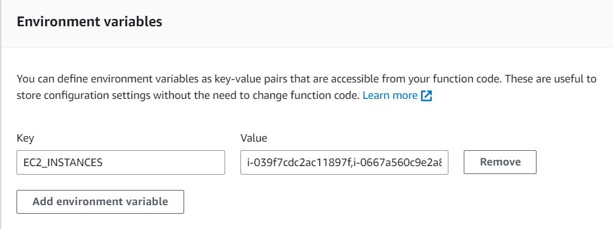
    
- Test - uspješno stopirane obje ec2 instance.

  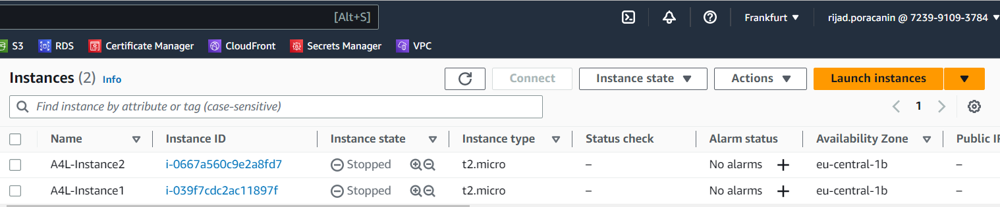
  
U nastavku je i Log Output

   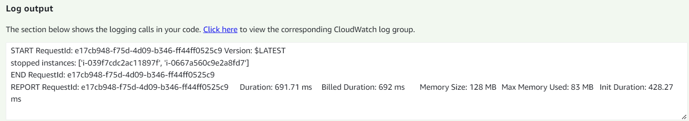
   
- Na isti način kreirao i Lambda funkciju 'EC2Start', u nastavku je python kod.

```python
import boto3
import os
import json

region = 'eu-central-1'
ec2 = boto3.client('ec2', region_name=region)

def lambda_handler(event, context):
    instances=os.environ['EC2_INSTANCES'].split(",")
    ec2.start_instances(InstanceIds=instances)
    print('started instances: ' + str(instances))
```

- U nastavku prikaz uspješnog testa:

    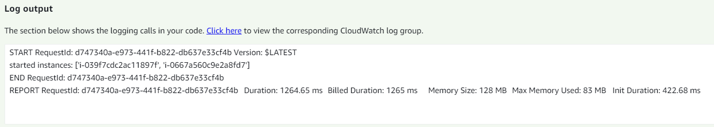
	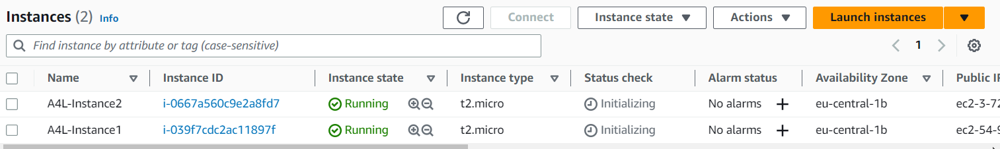
	

# Automated EC2 Control using lambda and events Part 2 (DEMO)

- Kreiramo novu Lambda funkciju 'EC2Protect', sa Python kodom prikazanim ispod.

```python
import boto3
import os
import json

region = 'eu-central-1'
ec2 = boto3.client('ec2', region_name=region)

def lambda_handler(event, context):
    print("Received event: " + json.dumps(event))
    instances=[ event['detail']['instance-id'] ]
    ec2.start_instances(InstanceIds=instances)
    print ('Protected instance stopped - starting up instance: '+str(instances))
```
   
- Kada god neka instanca bude stopirana, ova funkcija će da starta tu instancu.

Ideja je sljedeća. Kreiraćemo pravilo unutar EventBridge-a, i to pravilo će monitorisati Event Bus našeg accounta, i kada god vidi da je neka od instanci otišla u stop stanje, to će trigerovati ovo pravilo i proslijediće ovaj događaj ka targetu, a to je naša Lambda funkcija. I instanca će se restartovati.

 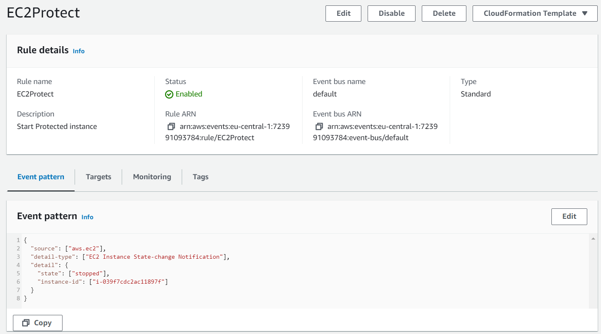
	
- Kada smo ugasili instancu1 koja je obuhvaćena ovim pravilom, ona se ugasila, ali je vrlo brzo automatski startana. Instanca2 koja nije obuhvaćena ovim pravilom je ostala u stanju Stopped.

  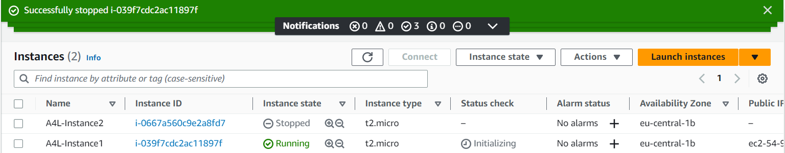
	 
- Cloudwatch logs:

   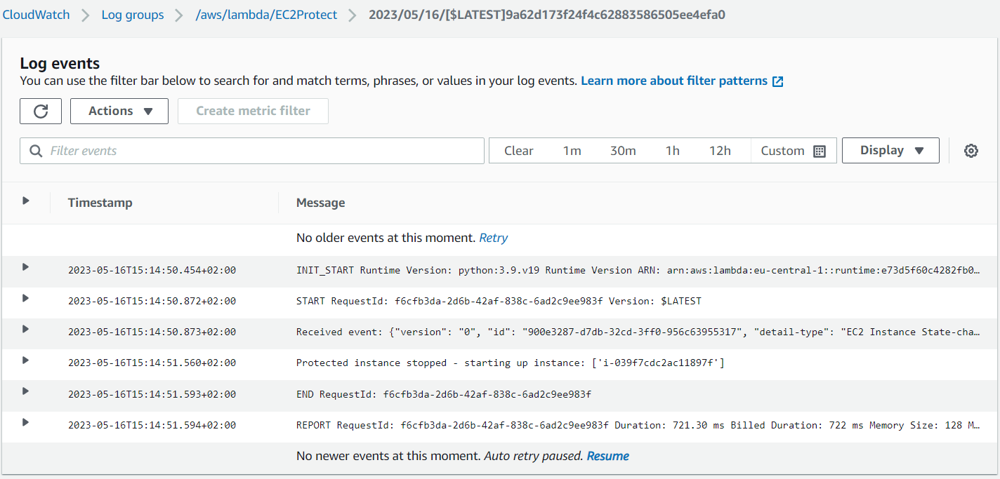
   
- Sada ćemo kreirati još jedno pravilo unutar EventBridge-a, koje će stopirati sve naše instance u određenom periodu dana (Schedule rule).

   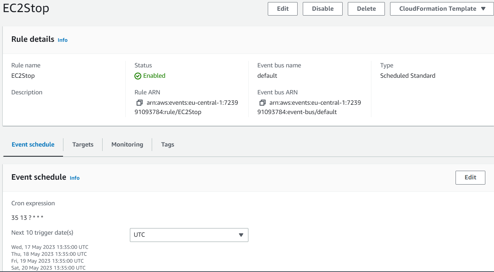
	
U tačno definisano vrijeme, obje instance su se ugasile, a zatim se instanca1 automatski startala.


# Serverless Architecture

Serverless je model gdje je cloud provajder odgovoran za izvršavanje koda dinamičkim dodjeljivanjem resursa. Samo se naplaćuje količina resursa 
koji su korišteni za pokretanje tog koda. Kod se obično pokreće unutar stateless kontejnera koji mogu biti pokrenuti raznim događajima uključujući HTTP 
zahtjeve, Database događaje, monitoring alerte, file uploads, scheduled events ( cron jobs ) itd. Kod koji se pošalje cloud provajderu za izvršavanje obično je u obliku funkcije ili manjih dijelova koda.


# Simple Notification Service (SNS)

- To je javni AWS servis - mrežna konektivnost sa javnim Endpointom;
- Koordinira slanje i dostavljanje poruka;
- SNS Topics je glavni entitet SNSa - permisije i konfiguracija;
- Publisher šalje poruke na TOPIC;
- TOPICS imaju pretplatnike (Subcribers) koji primaju te poruke;
- Pretplatnici mogu biti email adrese, HTTP(S), SQS queues, SMS poruke, Lambda...


# Step Functions

Step funkcije vam omogućavaju da kreirate tzv. State Machines. **State Machines** možete zamisliti kao neki workflow START -> STATES -> END.

Maksimalno trajanje State Machines unutar Step funkcije je 1 godina.

Dva tipa workflowa unutar Step funkcija: 
- **Standard** - defaultni. Execution limit: 1 godina.
- **Express** - dizajnirana za veće potrebe u smislu procesinga, npr. streaming, data processing, mobile app backend... Može biti pokrenuta 5 minuta.
	
State Machines mogu biti pokrenute preko API Gw, IOT pravila, EventBridge, Lambda...

IAM Role se koristi za permisije.

States su stvari unutar workflowa, npr:
- SUCCEED and FAIL;
- WAIT (održava ili pauzira proces);
- CHOICE (bira putanju);
- PARALLEL (da se kreira paralelni branch);
- MAP (prihvata listu nečega);
- TASK (predstavlja jedan dio rada kojeg izvrši State Machine);
	

# API Gateway 101

- API Gateway je servis koji nam omogućava da kreiramo i upravljamo API-ijima. API - Application Programming Interface - način na koji aplikacije komuniciraju jedna sa drugom.
- API Gw se ponaša kao Endpoint ili kao ulazna tačka za aplikacije koje komuniciraju sa servisima. Nalazi se između aplikacija i integracija (servisa).
- API Gw je javni servis i može se ponašati kao front end za servise unutar AWSa ili on-premises.
- Može omogućiti API-je koji koriste HTTP, REST ili čak websocket bazirane API-ije.
- API Gw Cache se može koristiti da smanji broj poziva ka backend integracijama i da poboljša klijentske performanse. Može biti enkriptovan.

API Gw podržava veliki opseg autentikacijskih metoda:
- Bez autentikacije;
- Cognito User pools sa tokenom;
- Lambda bazirana autorizacija (custom autorizacija);
	
**Stages** - APIs su podijeljeni na Stages, i svaki stages ima 1 deployment, i svaki stage ima svoj vlastiti jedinstveni URL endpointa.
Postoji verzionisanje, npr. verzija 1 za prod, i v2 za dev stage.

**Error kodovi**:
- 4xx - Client error - neispravan zahtjev na klijentskoj strani;
- 5xx - Server error - ispravan zahtjev, ali problem na backendu;
- 400 - Bad Request - Generic;
- 403 - Access Denied;
- 429 - Throttling - To znači da smo prešli konfigurisani throttling iznos;
- 502 - Bad Gw Exception - Lambda vraća nešto što je neispravno;
- 503 - Servis nedostupan;
- 504 - Integration Failure/Timeout - 29sek limit.
	

# Build a serverless app part 1

- Kreirao i verifikovao svoje dvije email adrese koristeći Simple Email Service.
 
 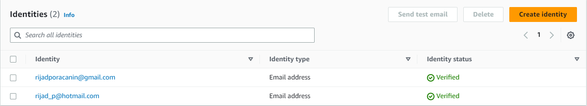
	

# Build a serverless app part 2

Sada ćemo konfigurisati Lambda funkciju koja će moći slati emailove koristeći SES, i konfigurisaćemo Execution Role koja će obezbijediti potrebne permisije.
- Kreirana IAM rola kojom dajemo Lambdi permisije da komunicira sa SES i SNS servisima i Logging permisije:

CloudWatch Logs:

```json
  {
    "Version": "2012-10-17",
    "Statement": [
        {
            "Action": [
                "logs:CreateLogGroup",
                "logs:CreateLogStream",
                "logs:PutLogEvents"
            ],
            "Resource": "arn:aws:logs:*:*:*",
            "Effect": "Allow"
        }
    ]
}
```

SES i SNS permisije:

```json
{
    "Version": "2012-10-17",
    "Statement": [
        {
            "Action": [
                "ses:*",
                "sns:*",
                "states:*"
            ],
            "Resource": "*",
            "Effect": "Allow"
        }
    ]
}
```

- Kreiramo Lambda funkciju koju će koristiti serverless aplikacija za slanje emailova.
   
```python 
import boto3, os, json

FROM_EMAIL_ADDRESS = 'rijad_p@hotmail.com'

ses = boto3.client('ses')

def lambda_handler(event, context):
    # Print event data to logs .. 
    print("Received event: " + json.dumps(event))
    # Publish message directly to email, provided by EmailOnly or EmailPar TASK
    ses.send_email( Source=FROM_EMAIL_ADDRESS,
        Destination={ 'ToAddresses': [ event['Input']['email'] ] }, 
        Message={ 'Subject': {'Data': 'Whiskers Commands You to attend!'},
            'Body': {'Text': {'Data': event['Input']['message']}}
        }
    )
    return 'Success!'
```


# Build a serverless app part 3

Sada ćemo dodati State Machine. Dakle, ovo će biti end-to-end serverless aplikacija, gdje state machine čeka određeno vrijeme, a onda koristi Lambda funkciju i SES za slanje Email notifikacija.
- Prvo ćemo kreirati IAM rolu koju će koristiti State Machine za interakciju sa ostalim AWS servisima.

CloudWatch Logs:

```json
{
    "Version": "2012-10-17",
    "Statement": [
        {
            "Action": [
                "logs:CreateLogGroup",
                "logs:CreateLogStream",
                "logs:PutLogEvents",
                "logs:CreateLogDelivery",
                "logs:GetLogDelivery",
                "logs:UpdateLogDelivery",
                "logs:DeleteLogDelivery",
                "logs:ListLogDeliveries",
                "logs:PutResourcePolicy",
                "logs:DescribeResourcePolicies",
                "logs:DescribeLogGroups"
            ],
            "Resource": "*",
            "Effect": "Allow"
        }
    ]
}
```

- Da State machine može pozivati Lambda funkciju i komunicirati sa SNS:

```json
{
    "Version": "2012-10-17",
    "Statement": [
        {
            "Action": [
                "lambda:InvokeFunction",
                "sns:*"
            ],
            "Resource": "*",
            "Effect": "Allow"
        }
    ]
}
```

- Kreiranje Step funkcije:

```json
{
  "Comment": "Pet Cuddle-o-Tron - using Lambda for email.",
  "StartAt": "Timer",
  "States": {
    "Timer": {
      "Type": "Wait",
      "SecondsPath": "$.waitSeconds",
      "Next": "Email"
    },
    "Email": {
      "Type" : "Task",
      "Resource": "arn:aws:states:::lambda:invoke",
      "Parameters": {
        "FunctionName": "arn:aws:lambda:us-east-1:723991093784:function:Email-Remainder-Lambda",
        "Payload": {
          "Input.$": "$"
        }
      },
      "Next": "NextState"
    },
    "NextState": {
      "Type": "Pass",
      "End": true
    }
  }
}
```

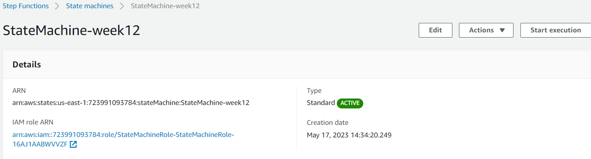


# Build a serverless app part 4

Sada ćemo dodati API Gw i potrebnu Lambda funkciju.
- Lambda funkcija koju će pozivati API Gw:

```python
# This code is a bit ...messy and includes some workarounds
# It functions fine, but needs some cleanup
# Checked the DecimalEncoder and Checks workarounds 20200402 and no progression towards fix

import boto3, json, os, decimal

SM_ARN = 'arn:aws:states:us-east-1:723991093784:stateMachine:StateMachine-week12'

sm = boto3.client('stepfunctions')

def lambda_handler(event, context):
    # Print event data to logs .. 
    print("Received event: " + json.dumps(event))

    # Load data coming from APIGateway
    data = json.loads(event['body'])
    data['waitSeconds'] = int(data['waitSeconds'])
    
    # Sanity check that all of the parameters we need have come through from API gateway
    # Mixture of optional and mandatory ones
    checks = []
    checks.append('waitSeconds' in data)
    checks.append(type(data['waitSeconds']) == int)
    checks.append('message' in data)

    # if any checks fail, return error to API Gateway to return to client
    if False in checks:
        response = {
            "statusCode": 400,
            "headers": {"Access-Control-Allow-Origin":"*"},
            "body": json.dumps( { "Status": "Success", "Reason": "Input failed validation" }, cls=DecimalEncoder )
        }
    # If none, start the state machine execution and inform client of 2XX success :)
    else: 
        sm.start_execution( stateMachineArn=SM_ARN, input=json.dumps(data, cls=DecimalEncoder) )
        response = {
            "statusCode": 200,
            "headers": {"Access-Control-Allow-Origin":"*"},
            "body": json.dumps( {"Status": "Success"}, cls=DecimalEncoder )
        }
    return response

# This is a workaround for: http://bugs.python.org/issue16535
# Solution discussed on this thread https://stackoverflow.com/questions/11942364/typeerror-integer-is-not-json-serializable-when-serializing-json-in-python
# https://stackoverflow.com/questions/1960516/python-json-serialize-a-decimal-object
# Credit goes to the group :)
class DecimalEncoder(json.JSONEncoder):
    def default(self, obj):
        if isinstance(obj, decimal.Decimal):
            return int(obj)
        return super(DecimalEncoder, self).default(obj)
```

- Kreirali smo REST API.
- Kreirali smo Resource i Metod za taj resource, tipa POST i dodali mu *api_lambda* funkciju.
- Zatim smo uradili **Deploy** tog API-ija. Kreirali smo novi Stage *prod*.
- Dobili smo Invoke URL: https://pckqoheqh7.execute-api.us-east-1.amazonaws.com/prod
   
   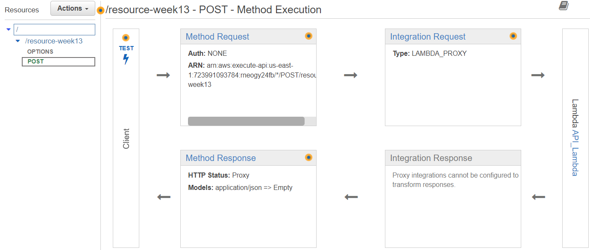


# Build a serverless app part 5

- Kreirali S3 bucket, u kojeg smo dodali Permission policy kako bi bucket bio javno dostupan.

```json
{
    "Version":"2012-10-17",
    "Statement":[
      {
        "Sid":"PublicRead",
        "Effect":"Allow",
        "Principal": "*",
        "Action":["s3:GetObject"],
        "Resource":["arn:aws:s3:::s3-week13/*"]
      }
    ]
  }
```

- Zatim smo omogućili Static Website Hosting.

  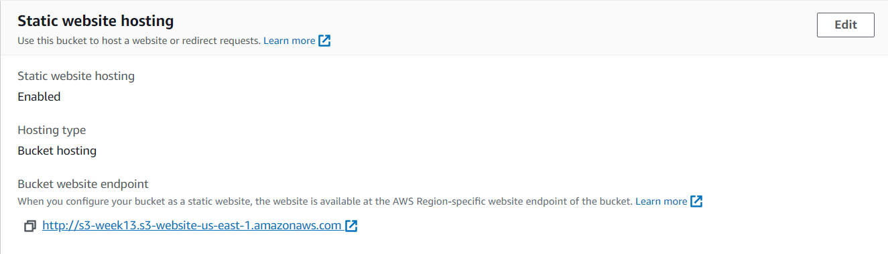
   
- Na s3 bucket sam uploadovao fajlove naše web aplikacije, i uspješno sam otvorio web stranicu i unio podatke za slanje emaila:

   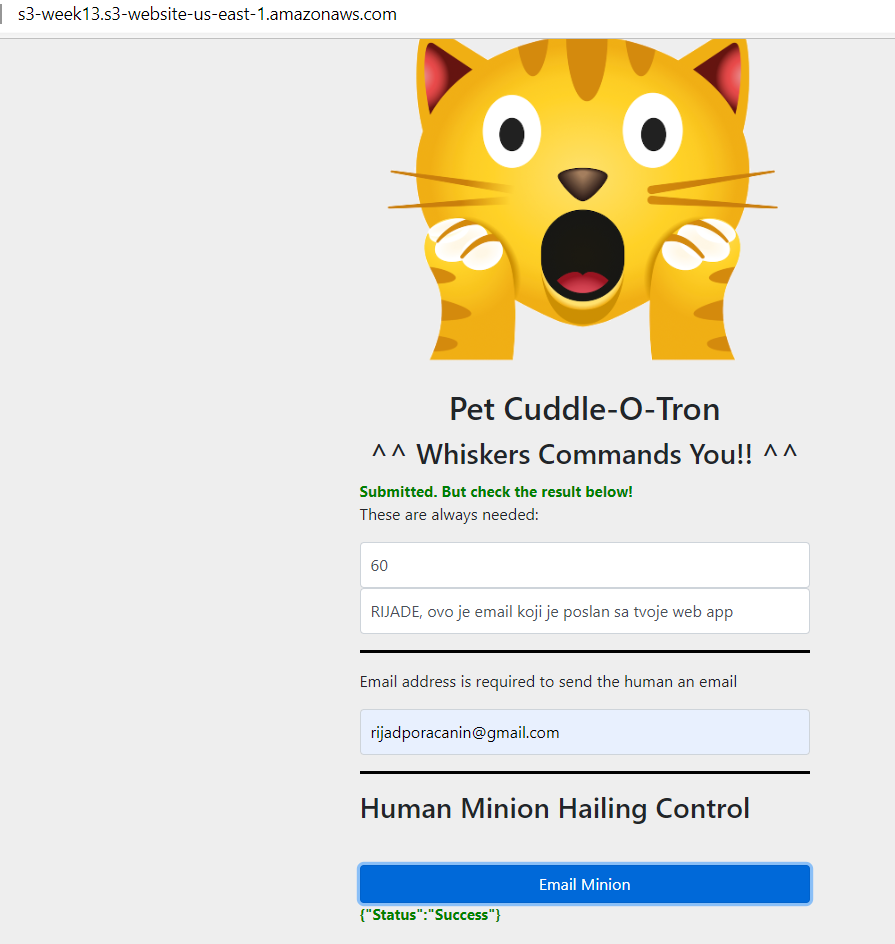
	
- Pogled na Execution status unutar prvih 60 sekundi:

   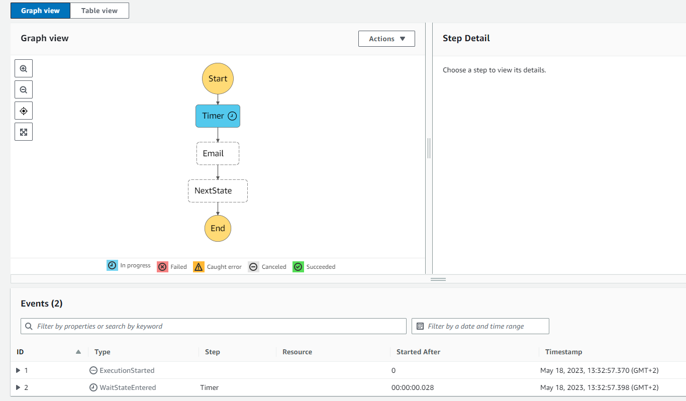
	
- Nakon 60 sekundi:

    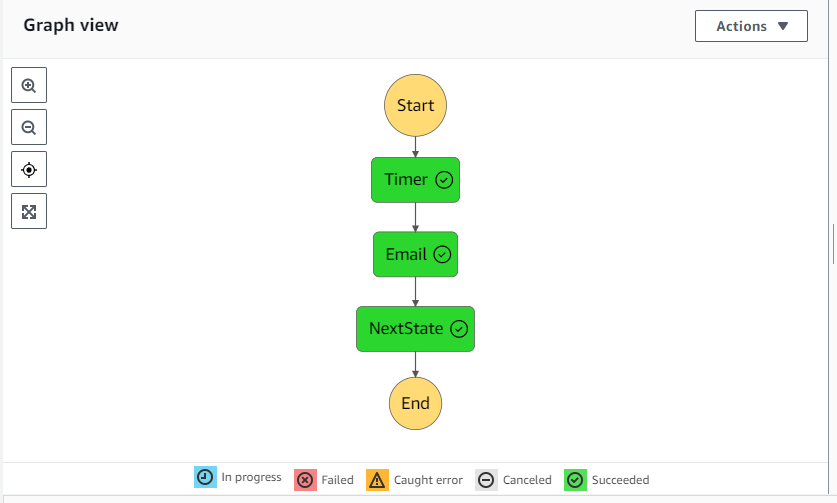
     
    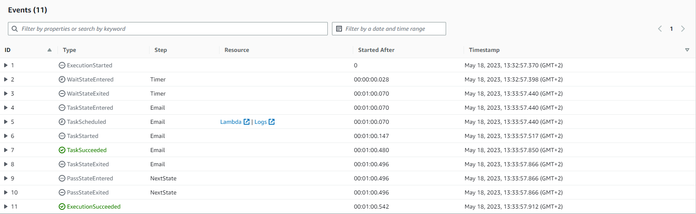
	 
- Pogled na logove State Machine:

   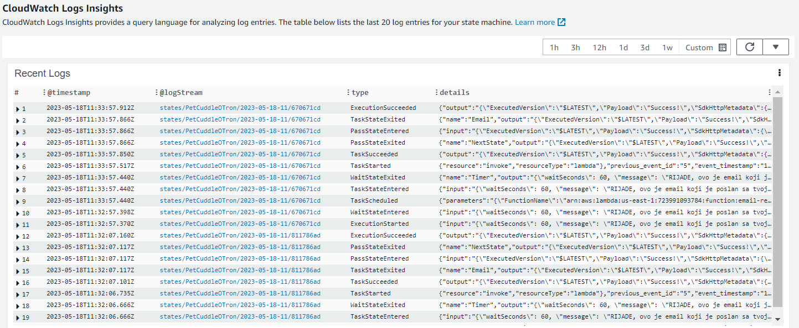

- Primljeni email:

    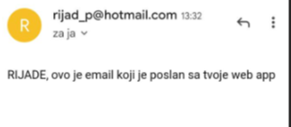
	

# Build a serverless app part 6

- Izbrisao sve resurse koje sam koristio za ovaj Demo.

- Moje razumijevanje aplikacije koju smo kreirali sam skicirao kroz Lucid Chart:

   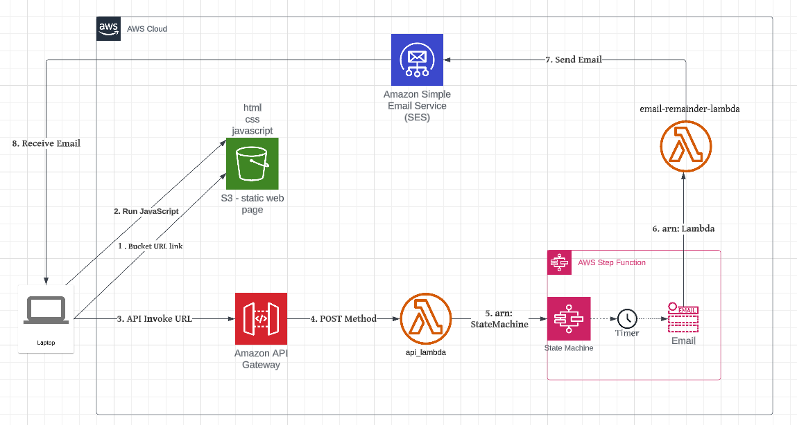


# Simple Queue Service (SQS)

SQS nam pruža mogućnost upravljanja redovima poruka. Javni je servis.

Postoji Standard queues i FIFO queues.

FIFO garantuje dostavu po redoslijedu i poruke će stići samo jednom.

Sa Standard queue postoji mogućnost da poruke ne stignu po redu po kojem su poslate i jedna poruka može stići više puta.. Garantuje se da će 
poruka stići, ali se ne zna po kojem redoslijedu.

Veličina poruka može biti veličine do 256 KB.

Polling je proces provjere poruka unutar queue.

Kada se poruke šalju ili primaju, te poruke se ne brišu odmah iz queue-a. One su sakrivene određeni period vremena (**VisibilityTimeout**), u kojem 
klijent može da procesira poruku na neki način. I ako se eksplicitno ne izbriše, ponovo će se pojaviti u queue.

**Dead-Letter queues** - Ako se ista poruka pojavljuje veći broj puta a nije procesirana, onda se može poslati u Dead-Letter queue.

Kod SQSa postoji 2 vrste pollinga:
- **Short Polling** (odmah) - koristi 1 request i može primiti nula ili više poruka.
- **Long Polling** (waitTimeSeconds) - do 20sek se može podesiti, i do 10 poruka.
	

# SQS Stadanard vs FIFO Queus

FIFO queues može obrađivati 300 poruka u sekundi bez batchinga, i 3000 sa batchingom. To je ustvari 300 transakcija u sekundi.

Sa Batchingom to znači da svaka transakcija može sadržavati 10 poruka.

Standard - može ići do beskonačno transakcija po sekundi.


# SQS Delay Queues

Delay Queues nam omogućavaju da odgodimo dostavu poruka.

Visibility timeout - poruke se trebaju pojaviti u queue i biti primljene prije nego nastupi Visibility timeout. Dakle, ovo se koristi za 
error correction i da se omogući automatsko reprocesiranje. 

Sa Delay queues, konfigurišemo vrijednost koju nazivamo DelaySeconds. Što znači da će poruke u queue biti nevidljive za vrijednost DelaySeconds.
Nakon tog perioda postaće vidljive. Defaultna vrijednost je nula, max je 15 minuta.
