# TASK-11: AWS Tools GitFlow Workshop

# Branching Models

Dva popularna Branching modela:
- Trunk Based
- Feature-based ili GitFlow model

# Trunk-Based development

Unutar Trunk based modela, developeri sarađuju unutar jednog branch-a kojeg nazivamo *"trunk"*. Ovim izbjegavamo kompleksnost merge-anja.
U Amazonu ohrabruju svoje timove da koriste Continuous Integration preko Trunk-Based modela, gdje developeri merge-aju svoje promjene nekoliko puta na dan u centralni repozitorij.

# Feature-based (GitFlow) development

Razlozi zbog kojih se koristi ovaj model:
- Više timova može raditi na različitim feature release-ima sa različitim timeline-ima.
- Organizacije koje pružaju SaaS možda imaju klijente koji ne žele biti na posljednjoj verziji.
- Pojedini timovi unutar organizacije mogu imati specifične QA/UAT zahtjeve koji zahtjevaju ručna odobrenja, i koji mogu izazvati kašnjenje u produkciju.

# GitFLow

GitFlow uključuje kreiranje nekoliko nivoa branchinga, gdje **Master** grana uvijek sadrži produkcijski kod, a **Develop** grana je grana koja sadrži novi kod.
Ove dvije grane su tzv. *long-running branches* jer ostaju u našem projektu cijelo vrijeme. Ostale grane, npr. za feature ili release, postoje samo trenutačno, kreiraju se na zahtjev i brušu se nakon što su ispunile svoju svrhu.

# GitFLow guidelines:

- Koristiti *development* kao continuous integration branch.
- Koristite feature branches za rad na više feature-a.
- Koristite release branches za rad na različitim releasima.
- Koristite hotfix branches od mastera da pushate hotfix.
- Merge-ajte master nakon svakog release-a.
- Master sadrži kodove spremne za produkciju.

  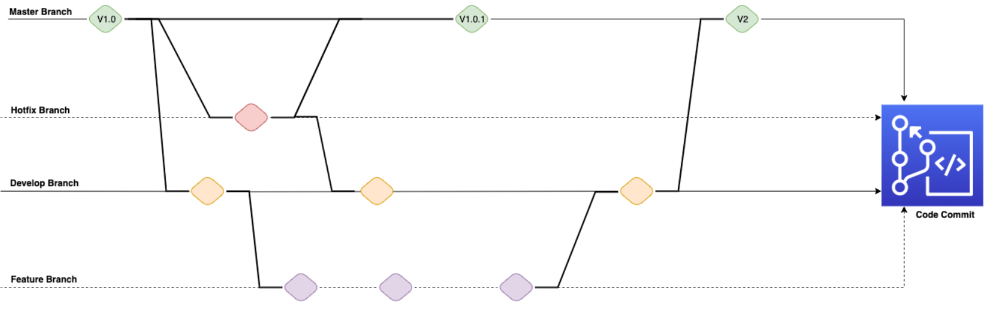

### Crtice iz članka *A successful Git branching model*

- Vincent Driessen je u ovom članku (link: https://nvie.com/posts/a-successful-git-branching-model/) predstavio model razvoja koji je uveo za neke svoje projekte i koji su se pokazali veoma uspješnim. Taj model je ustvari skup procedura koje svaki član tima mora slijediti kako bi se došlo do upravljanog procesa razvoja softvera.
- Ideja da postoji jedan glavni repozitorij naziva npr. `origin`. Svaki developer radi *push* i *pull* ka originu, jer je origin centralno mjesto.
- Centralni repo ima dvije grane sa beskonačnim rokom trajanja: **master** i **develop**.
- Origin/Master je glavna grana u kojoj kod uvijek odražava stvarno produkcijsko stanje.
- Origin/develop je glavna grana koja odražava stanje sa najnovijim isporučenim promjenama koda za sljedeće izdanje. Neki ovo nazivaju *Integration branch*.
- Postoji još različitih grana koje su podržane: **Feature branches**, **Release branches**, **Hotfix branches**.
- Suština Feature branch-a je da ona postoji sve dok je feature u razvoju, ali će na kraju biti spojen u develop branch kako bi se na taj način dodao (ili eventualno bio odbačen) taj novi feature u nadolazećem release-u. Feature branches obično postoje samo u developer repozitorijumu, ne i u originu.
- Release branches podržavaju pripremu novog produkcijskog release-a. Kreiraju se iz develop grane.
- Hotfix branches su veoma slične release branchu, jer su namijenjeni za pripremu za novi produkcijski release, doduše neplanirani. Kreiraju se iz master grane.

# Kreiranje feature grane

Najprije se trebamo odvojiti od *develop* grane:

```git
git checkout -b myfeature develop
```

Završeni feature-i se mogu merge-ati u *develop* branch, kako bi ga dodali u nadolazećem release-u:

```
git checkout develop

git merge --no-ff myfeature

git branch -d myfeature #deleted

git push origin develop
```

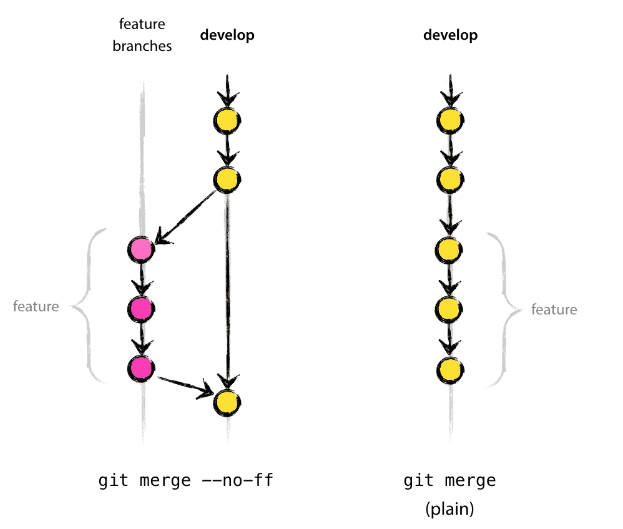

# Kreiranje release grane

Prebacivanje u novi branch 'release-1.2', modifikacija fajlova skriptom, i commit:

```git

$ git checkout -b release-1.2 develop

$ ./bump-version.sh 1.2

$ git commit -a -m"prelazak na v1.2"
```

Kada je stanje release grane spremno za produkciju, release grana se spaja u master (po definiciji, svaki commit na masterz je novi release). Promjene na release grani se trebaju merge-ati nazad u develop granu, tako da budući release-i sadrže ove promjene.

```git
$ git checkout master

$ git merge --no-ff release-1.2

$ git tag -a 1.2

$ git checkout develop

$ git merge --no-ff release-1.2

```

Kada smo to završili, ovaj release branch nam više nije potreban i možemo ga izbrisati `$ git branch -d release-1.2`.

# Kreiranje hotfix grane

```git

$ git checkout -b hotfix-1.2.1 master

$ ./bump-version.sh 1.2.1

$ git commit -a -m "Bumped version number to 1.2.1"

$ git commit -m "Fixed severe production problem"

```

Po završetku, bugfix se treba merge-ati nazad u master, ali također i u develop granu:

```git

$ git checkout master

$ git merge --no-ff hotfix-1.2.1

$ git tag -a 1.2.1

$ git checkout develop

$ git merge --no-ff hotfix-1.2.1
```

Na kraju kada smo završili možemo ukloniti branch `git branch -d hotfix-1.2.1`.

### Pokretanje AWS Cloud9

- Unutar AWS Cloud9 kreirao environment sa imenom `gitflow-workshop`.

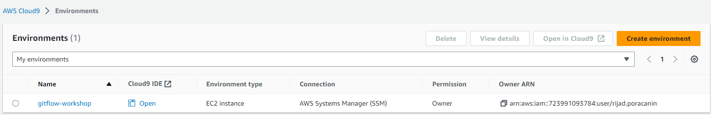

### Access AWS Cloud9 IDE

**AWS Cloud9** je cloud-based integrisano development okruženje (IDE), koji vam omogućava pisanje, pokretanje, i debug vašeg koda sa vašim browserom. Uključuje Code editor, debugger, i terminal.

- Po defaultu, EBS volume koji je pridružen Cloud9 instanci je 10 GiB, što možemo potvrditi komandom `df -h`:

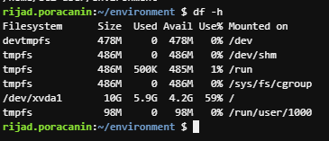

- Želimo da povećamo veličinu ovog volume, stoga kreirajmo fajl za skriptu, *resize.sh*. Unutra ćemo zalijepiti skriptu iz dokumentacije. Skripta se nalazi u mom repu na lokaciji /week-13/all-files-and-dirs-used-for-this-task/resize.sh.

```linux
touch resize.sh
```

- Pokretanjem ove skripte komandom `bash resize.sh 30` povećavamo veličinu volume na 30GiB, što se vidi iz slika ispod.

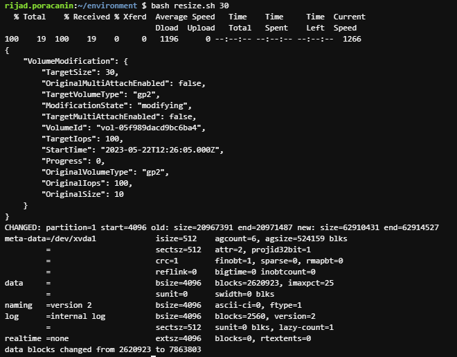

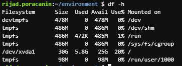

### Initial setup i AWS CLI Credential Helper

`git config` komandu koristimo da postavimo Git konfiguraciju.

```

$ git config --global user.name "rijadp"

$ git config --global user.email rijad_p@hotmail.com

```

Sada konfigurišemo AWS CLI credential helper za upravljanje kredencijalima za konekciju na vaš repozitorijum. Credential helper dopušta Gitu da koristi HTTPS i kriptografski potpisanu verziju kredencijala vašeg IAM korisnika kada god Git treba da autenticira sa AWSom da bi komunicirao sa repozitorijumima.
Da bi konfigurisali AWS CLI credential helper za HTTPS konekcije, pokrećemo sljedeće komande:

```
git config --global credential.helper '!aws codecommit credential-helper $@'
git config --global credential.UseHttpPath true
```

### Install gitflow

*gitflow* je kolekcija Git ekstenzija koja nam pruža high-level repo operacije za gore spomenuti Driessen branching model. Komande su sljedeće:

```

curl -OL https://raw.github.com/nvie/gitflow/develop/contrib/gitflow-installer.sh
chmod +x gitflow-installer.sh
sudo git config --global url."https://github.com".insteadOf git://github.com
sudo ./gitflow-installer.sh

```

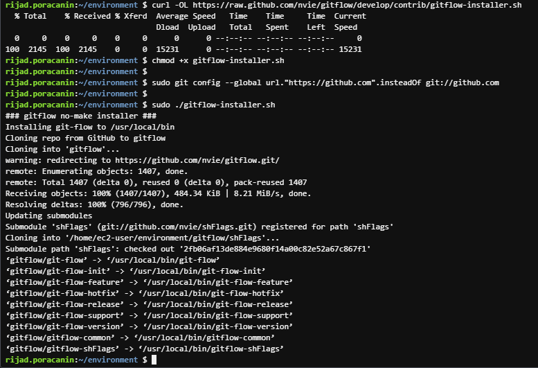

### AWS CloudFormation

U ovom modulu ćemo koristiti AWS CloudFormation da podesimo našu aplikaciju i infrastrukturu. Koristićemo **AWS Elastic Beanstalk** da pojednostavimo stvari.

## Elastic Beanstalk Application

# Stage 1: Create Code Commit Repo

```
aws codecommit create-repository --repository-name gitflow-workshop --repository-description "Repository for Gitflow Workshop"

git clone https://git-codecommit.us-east-1.amazonaws.com/v1/repos/gitflow-workshop

```

- Kreiran je Codecommit repozitorij:

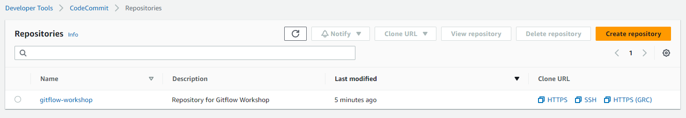

# Stage 2: Download the sample code and commit your code to the repository

- Download the sample app archive:

```
$ ASSETURL="https://static.us-east-1.prod.workshops.aws/public/442d5fda-58ca-41f0-9fbe-558b6ff4c71a/assets/workshop-assets.zip"; wget -O gitflow.zip "$ASSETURL"

```

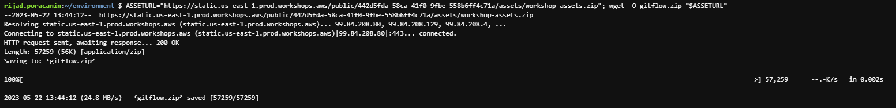

- Raspakujemo arhivu u lokalni repo folder:

```
unzip gitflow.zip -d gitflow-workshop/

```

- Pozicioniramo se u naš lokalni repo folder i pokrenemo git add.

```
cd gitflow-workshop

git add -A

```

- Pokrenemo 'git commit' da potvrdimo izmjene i pushamo ih u *master*.

```
git commit -m "Initial Commit"

git push origin master

```

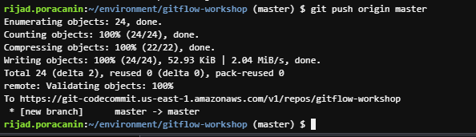

# CREATE ELASTIC BEANSTALK APPLICATION

Da bismo koristili Elastic Beanstalk, prvo ćemo kreirati aplikaciju, koja će predstavljati našu aplikaciju unutar AWS-a. Pokrenućemo template ispod kako bismo kreirali Elastic Beanstalk aplikaciju  (možemo je posmatrati kao folder koji čuva komponente našeg Elastic Beanstalka.), i S3 bucket (mjesto u koje se stavlja kod naše aplikacije prije deploymenta).

```

aws cloudformation create-stack --template-body file://appcreate.yaml --stack-name gitflow-eb-app

```

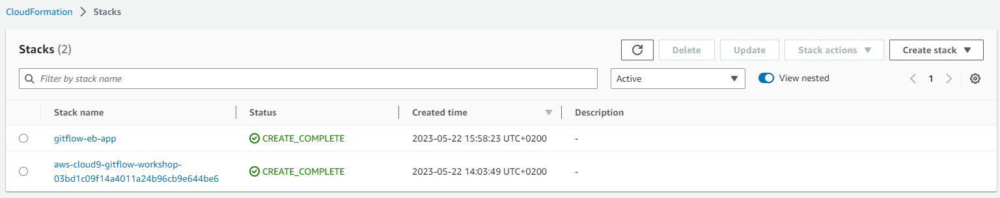

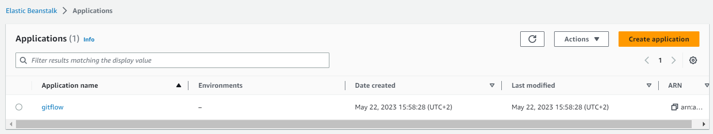

# Creating an AWS Elastic Beanstalk Master Environment

Možemo deployati vise okruženja ako želimo da pokrećemo vise verzija aplikacije. Npr. možemo imati development, integracijski i produkcijski environment.

Koristićemo AWS CloudFormation template da podesimo elastic beanstalk aplikaciju i codepipeline da odrade "auto store" nasih artefakata:

```
aws cloudformation create-stack --template-body file://envcreate.yaml --parameters file://parameters.json --capabilities CAPABILITY_IAM --stack-name gitflow-eb-master


```

- Prvi put ova komanda nije bila uspješna, nisu se mogle kreirati *BeanstalkConfigurationTemplate* i *BeanstalkEnvironment*, pa je bilo potrebno unutar *envcreate.yaml* fajla promijeniti verziju Amazon Linuxa:
`` SolutionStackName: "64bit Amazon Linux 2 v5.8.1 running Node.js 16" ``

- Greška `The instance profile aws-elasticbeanstalk-ec2-role associated with the environment does not exist.` koja se pojavljivala u Eventima unutar Elastic Beanstalka je ukazivala da nedostaje IAM rola *aws-elasticbeanstalk-ec2-role* kojom dajemo permisije da EC2 servis može pozivati Elasticbeanstalk servise, pa sam je kreirao. Nakon toga je kreiranje stacka bilo uspješno.

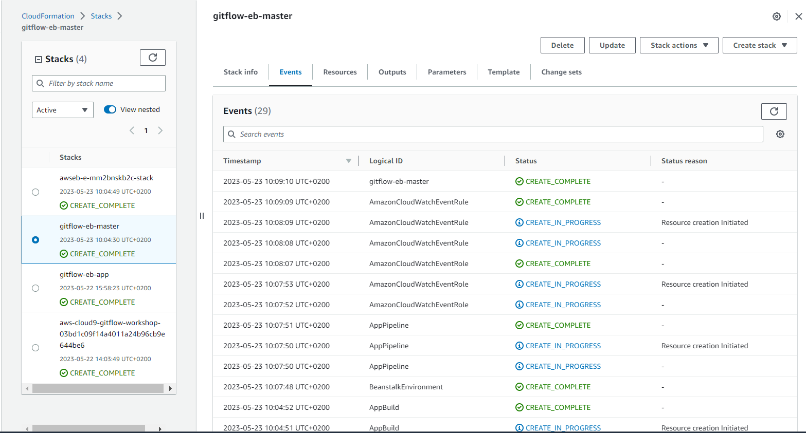

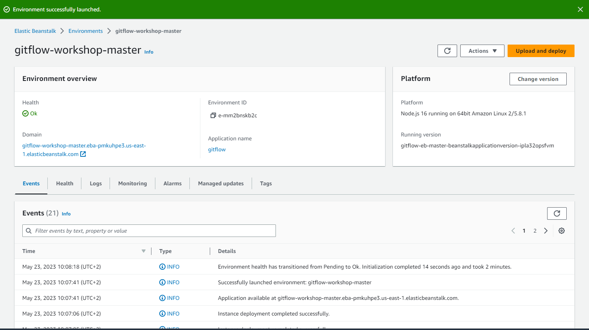

# AWS CodePipeline

AWS CodePipeline je continuous delivery servis kojeg možemo koristiti za modeliranje, prikaz, i automatizaciju koraka potrebnih za release našeg softvera.
Prethodni cloudformation template je kreirao i konfigurisao jednostavan AWS CodePipeline sa 3 akcije: source, build i deploy.

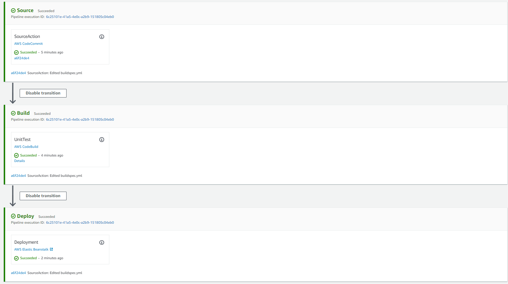

# Create Lambda

- Unutar S3 bucketa *elasticbeanstalk-us-east-1-723991093784* potrebno podesiti Default encryption koristeći KMS enkripcijski tip.

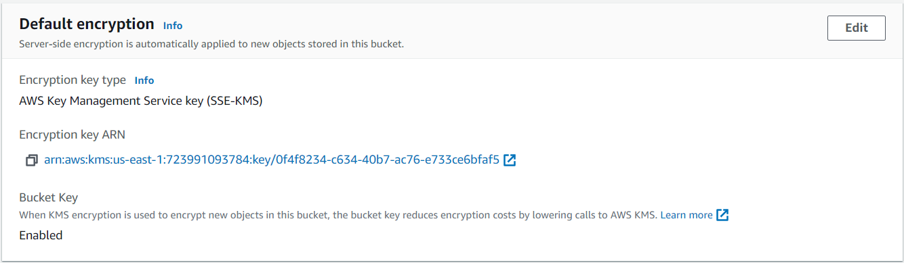

- Kopirao ARN enkripijskog ključa koji je dodijeljen u .txt file, i preimenovao sam ga u *.elasticbeanstalk*
- Zatim sam ovaj file zipovao u *elasticbeanstalk.zip* i takvog ga upload-ovao u bucket *elasticbeanstalk-us-east-1-723991093784*.
- Unutar *lambda-create.yaml* fajla sam u polje `S3Bucket` unio naziv bucketa: `'elasticbeanstalk-us-east-1-723991093784'`, i u polje `S3Key:` unio naziv prethodno uploadovanog fajla `'elasticbeanstalk.zip'`.
- Uradio `git push` na master granu, i pokrenuo komandu za kreiranje lambda funkcije:
```
aws cloudformation create-stack --template-body file://lambda/lambda-create.yaml --stack-name gitflow-workshop-lambda --capabilities CAPABILITY_IAM

```

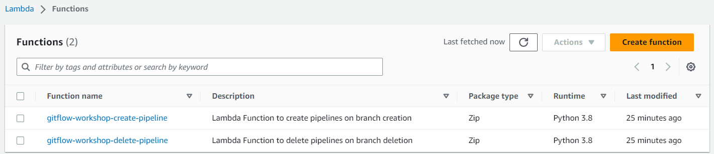

# Create a Trigger in AWS CodeCommit for an Existing AWS Lambda Function

Možemo konfigurisati CodeCommit repozitorij tako da se trigeruju akcije pushanjem koda ili drugim eventima, kao npr. slanjem notifikacija sa Amazon SNSa ili pozivanjem Lambda funkcija.

- Kreirao sam trigere za Create i Delete branch.

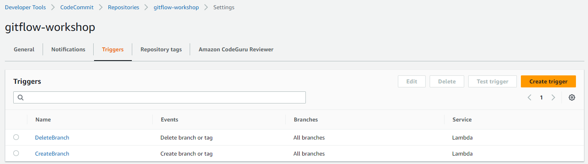

# Develop Branch - Create Develop Branch

- Kada koristimo git-flow extension library, pokretanjem `git flow` na postojećem repu, kreiramo develop branch.

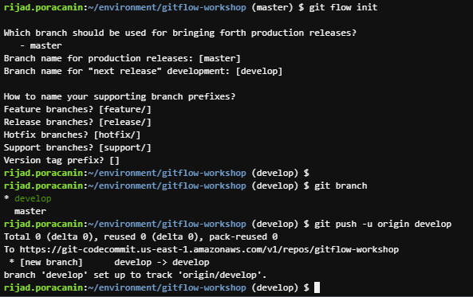

- Manuelano kreiran Development environment za develop branch, komandom:

```
aws cloudformation create-stack --template-body file://envcreate.yaml --parameters file://parameters-dev.json --capabilities CAPABILITY_IAM --stack-name gitflow-workshop-develop

```

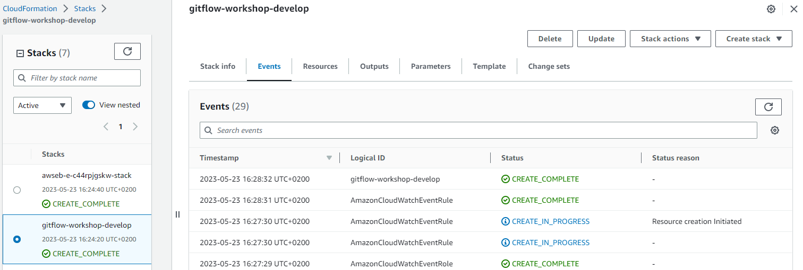

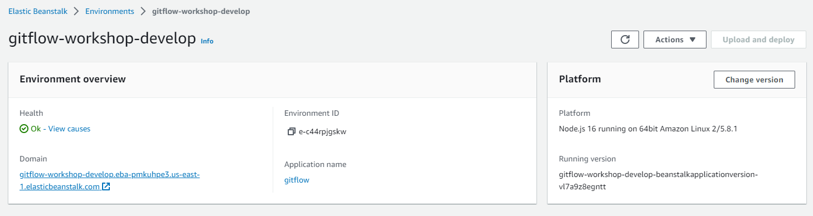

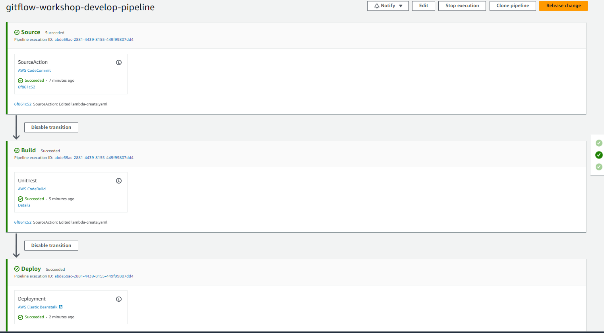

# Feature Branch - Create Feature Branch

- Kreiraćemo feature branch s kojim ćemo promijeniti boju editovanjem index.html fajla.

```
git flow feature start change-color

```
- Ovo će automatski kreirati novi branch imena *change-color* iz *develop* brancha.

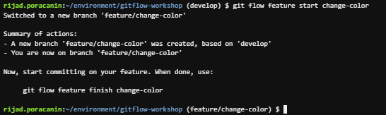

- Unutar *index.html* fajla sam proijenio boju iz ljubičaste u zelenu.

-Manuelno kreiran development environment:

```
aws cloudformation create-stack --template-body file://envcreate.yaml --capabilities CAPABILITY_IAM --stack-name gitflow-workshop-changecolor --parameters ParameterKey=Environment,ParameterValue=gitflow-workshop-changecolor ParameterKey=RepositoryName,ParameterValue=gitflow-workshop ParameterKey=BranchName,ParameterValue=feature/change-color

```

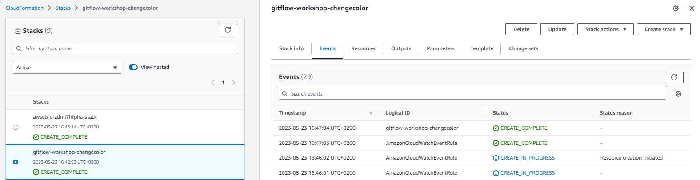

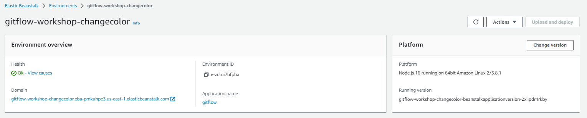

# Feature Finish

- završavamo razvoj feature-a sa sljedećom komandom:

```
git flow feature finish change-color
```

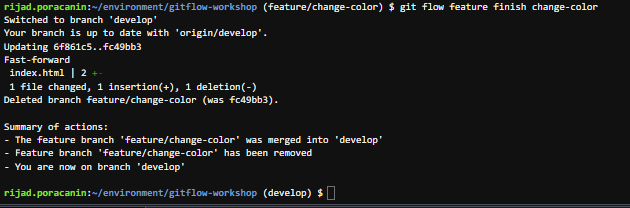

- Ovom akcijom smo merge-ali *change-color* u *develop*, uklonili smo feature branch i prebacili se nazad u develop branch.

```
git push origin --delete feature/change-color
```

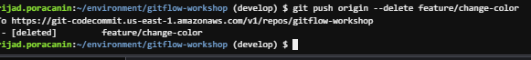

-Sada radimo commit develop brancha:

```
git push --set-upstream origin develop
```

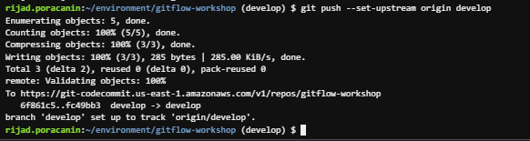

- Sada kada otvorimo URL preko develop brancha vidimo da su primjenjene promjene (podloga je zelena).

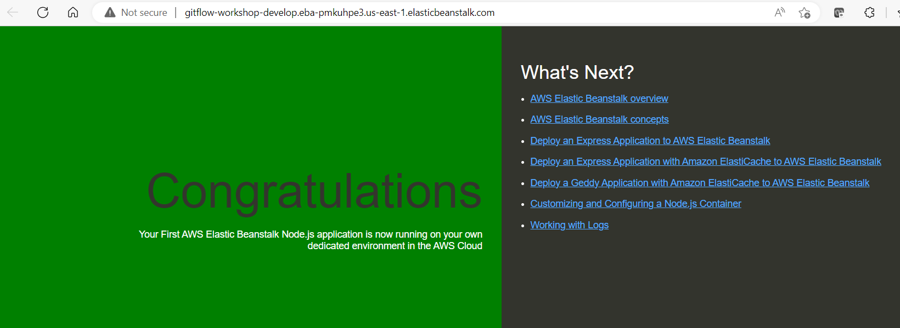
