# Task 12 Packer - > Ansible -> CloudFormation / Terrafrom 

## Installing Packer
Preko Cloud9 pokrenuo okruženje sa EC2 instancom na kojoj je Ubuntu OS, i na kojoj sam instalirao Packer na sljedeći način:
- Dodao HashiCorp GPG key.
```ubuntu
$ curl -fsSL https://apt.releases.hashicorp.com/gpg | sudo apt-key add -
```

- Dodao oficijalni HashiCorp Linux repositorij
```ubuntu
$ sudo apt-add-repository "deb [arch=amd64] https://apt.releases.hashicorp.com $(lsb_release -cs) main"
```

- Update i instalacija
```ubuntu
$ sudo apt-get update && sudo apt-get install packer
```

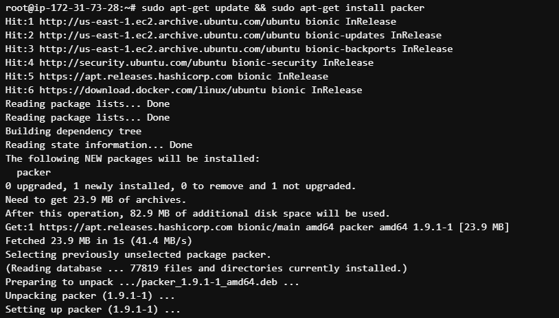

### Create Custom AMI image from Amazon Linux 3 AMI image where you will have needed yum repos installed and enabled to install nginx web server and mysql database.

- *ami-task12.json* file kojeg sam koristio za Packer izgleda:
```json
{
    "builders": [{
      "type": "amazon-ebs",
      "region": "us-east-1",
      "source_ami": "ami-022e1a32d3f742bd8",
      "instance_type": "t2.micro",
      "ssh_username": "ec2-user",
      "temporary_key_pair_type": "ed25519",
      "ami_name": "ami-task12 {{timestamp}}",
      "tags": {
        "Name": "task12-ami",
        "CreatedBy": "rijad.poracanin",
        "Project": "Task12",
        "IaC": "Packer"
      }
    }],
    "provisioners": [{
            "type": "shell",
            "script": "./packer-script.sh"
    }]
}
```

- Shell skripta *packer-script.sh* koja se poziva iz *.json* fajla izgleda:
```shell
#yum repos for nginx and mysql database

sudo yum update -y
sudo yum install -y yum-utils
sudo rpm --import https://repo.mysql.com/RPM-GPG-KEY-mysql-2022
wget http://dev.mysql.com/get/mysql57-community-release-el7-8.noarch.rpm
```

- Prije pokretanja Packer aplikacije, komandom `aws configure` sam dodao *access key* našeg AWS računa.

- A zatim sam pokrenuo Packer aplikaciju komandom 
```packer
packer build ami-task12.json
```
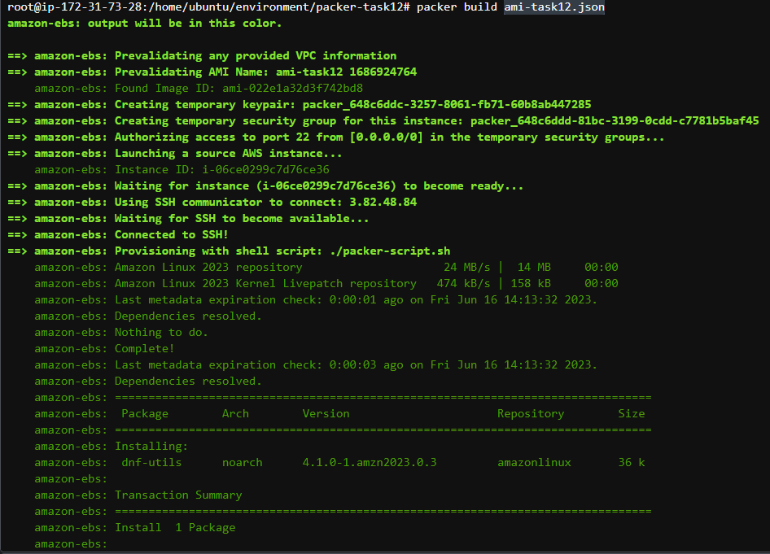

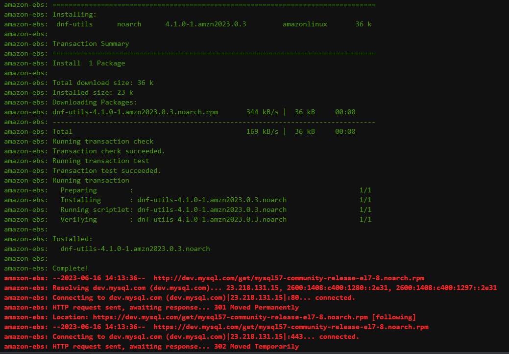

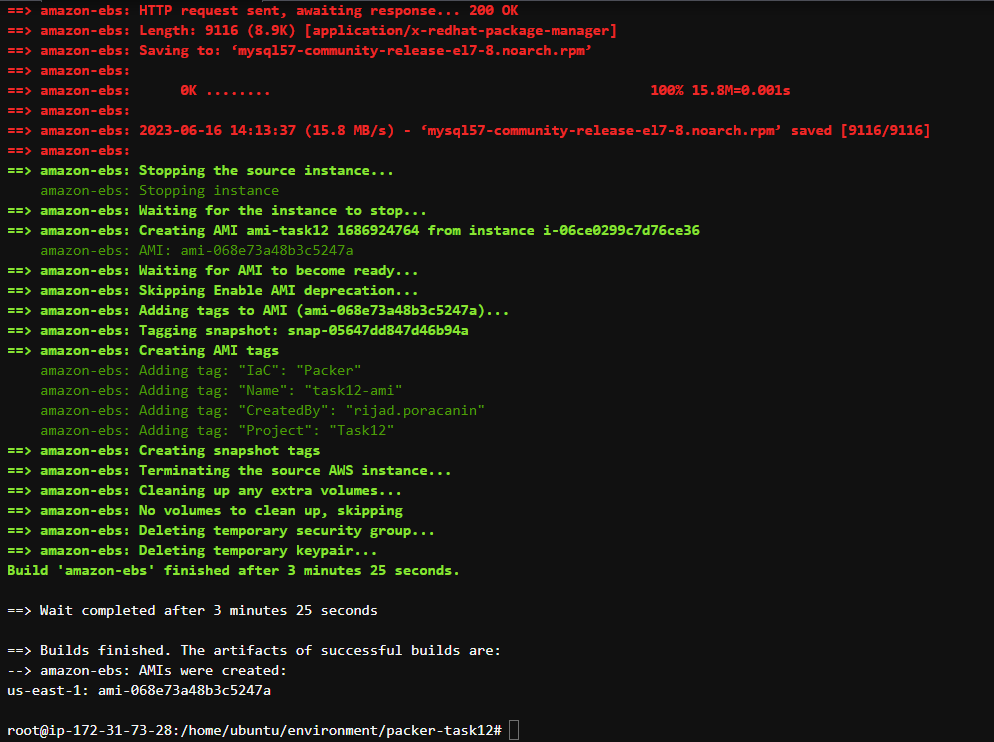

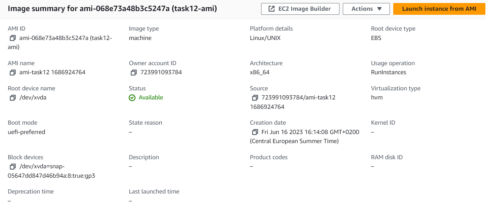


### [IaC - CloudFormation] Using an AMI image from step 1 create 2 new EC2 instances called *task-12-web-server-cf* and *task-12-db-server-cf*. For those instances create appropriate security groups and open needed ports. Please try to follow best practices for security groups. You can put your resources inside default VPC and public subnets.

- Template u YAML formatu *cf_template* kojeg sam kreirao se nalazi u folderu */CloudFormation*. U njemu sam konfigurisao da se kreiraju resursi: 2 EC2 instance (webserver i dbserver) iz AMI image-a kojeg sam kreirao u prvom dijelu zadatka preko Packer aplikacije, i dvije Security grupe za ta dva servera.
- Kroz AWS CloudFormation sam učitao ovaj template i kreiran je stack.

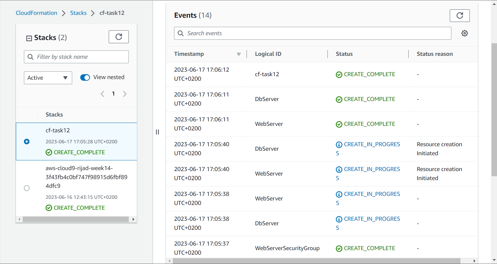

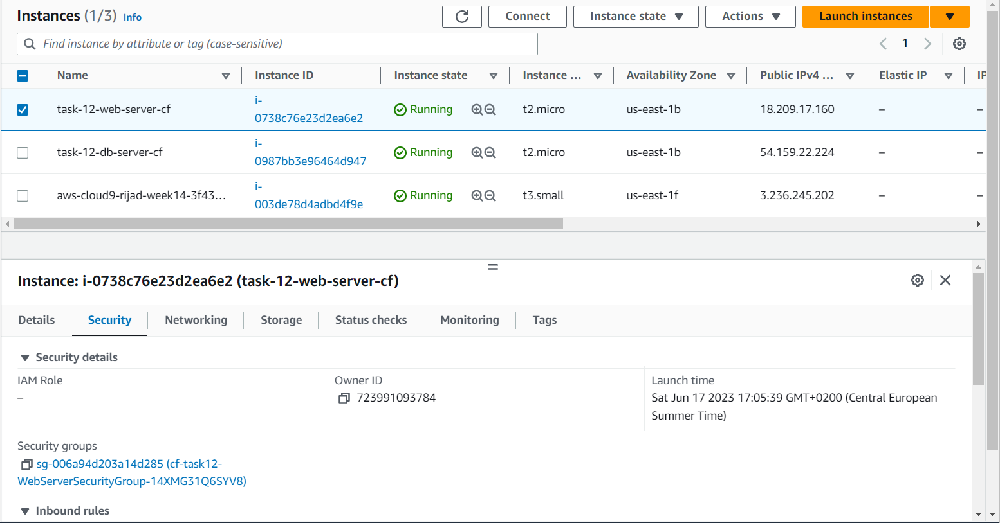

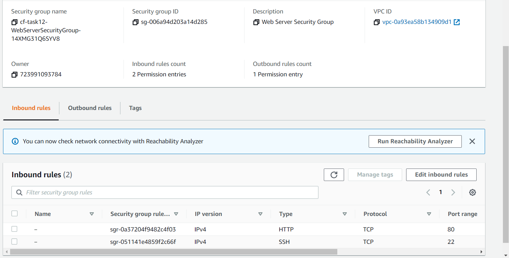


## Installing Terraform

```ubuntu
$ wget -O- https://apt.releases.hashicorp.com/gpg | sudo gpg --dearmor -o /usr/share/keyrings/hashicorp-archive-keyring.gpg
```

```ubuntu
echo "deb [signed-by=/usr/share/keyrings/hashicorp-archive-keyring.gpg] https://apt.releases.hashicorp.com $(lsb_release -cs) main" | sudo tee /etc/apt/sources.list.d/hashicorp.list
```

```ubuntu
sudo apt update && sudo apt install terraform
```

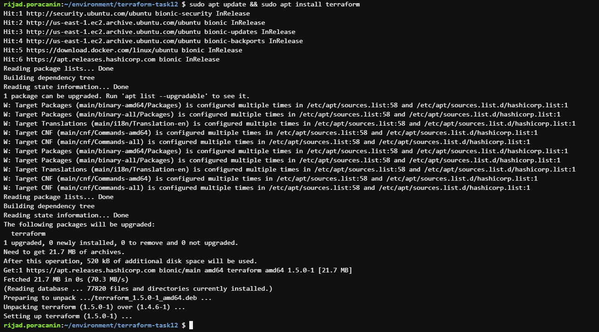

###  [IaC - Terraform] Using an AMI image from step 1 create 2 new EC2 instances called task-12-web-server-tf and task-12-db-server-tf. For those instances create appropriate security groups and open needed ports. Please try to follow best practices for security groups. You can put your resources inside default VPC and public subnets.

Konfiguracijski fajlovi *providers.tf* i *main.tf* se nalaze u folderu */Terraform*.
- Komandom `terraform init` sam uradio inicijalizaciju konfiguracije. 
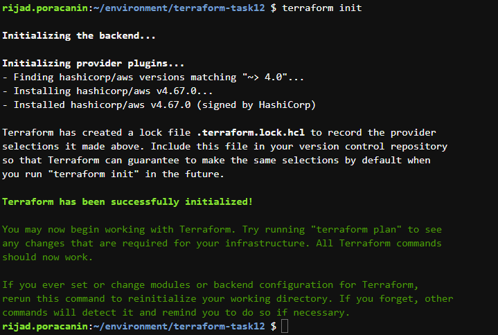

- Komandom `terraform apply` sam izvršio konfiguraciju.
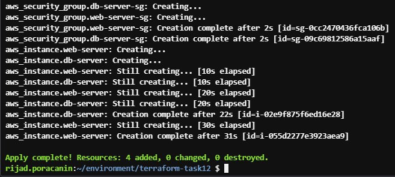

- Resursi su kreirani:
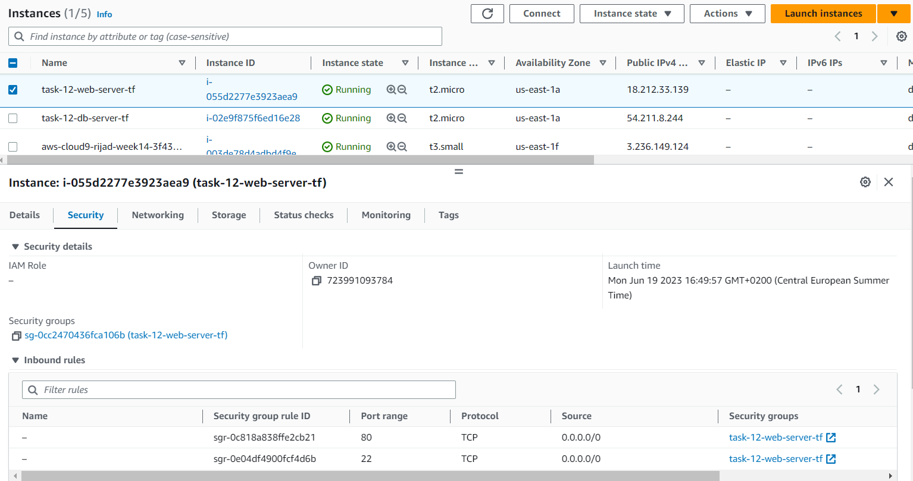

## Installing Ansible

- Najprije trebamo sa sljedećom komandom da provjerimo da li je `pip` već instaliran za naš Python:
```ubuntu
$ python3 -m pip -V
```

Dobio sam sljedeći output:

```
pip 9.0.1 from /usr/lib/python3/dist-packages (python 3.6)
```

- Pošto je ovo starija verzija, trebamo upgradovati `pip` na noviju verziju, a zatim instalirati ansible:

```ubuntu
$ pip install --upgrade pip
$ pip install ansible
```

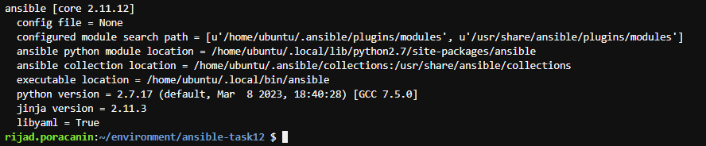

### [Ansible] By using ansible provisioner install nginx web server on task-12-web-server-cf and task-12-web-server-tf instances.

- Fajlovi *ansible.cfg*, *inventory.ini* i *nginx-playbook.yml* se nalaze u folderu */Ansible* i tu se može vidjeti njihov sadržaj.
- Neophodno je da .pem fajl ne bude dostupan drugim korisnicima sa serveru, zbog sigurnosnih razloga, pa sam morao promijeniti permisije .pem fajla na način da su dostupni samo mom korisniku (0600 - samo read i write za ownera):

```
$ chmod 600 rijad-poracanin-web-server-key.pem
```

- Fajl *nginx-playbook.yml* će instalirati Nginx paket, pokrenuće Nginx servis i omogućiti da bude startan i prilikom startanja servera. Ovaj playbook sam pokrenuo komandom:
```ubuntu
$ ansible-playbook nginx-playbook.yml
```
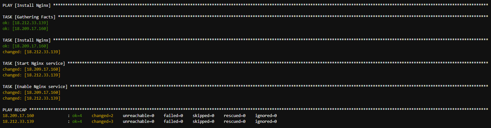

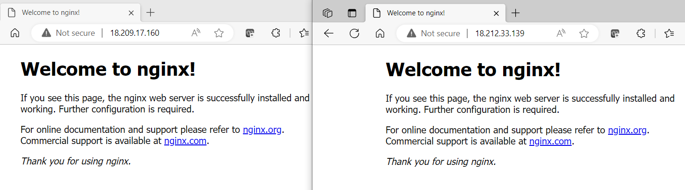

### Also your nginx web server instances needs to have index.html file with content *"Hello from nginx web server created using CloudFormation and Ansible Hello from nginx web server created using Terrafrom and Ansible"*

- Fajlovi *nginx-index-playbook* i *index.html* se nalaze u folderu */Ansible* i tu se može vidjeti njihov sadržaj.

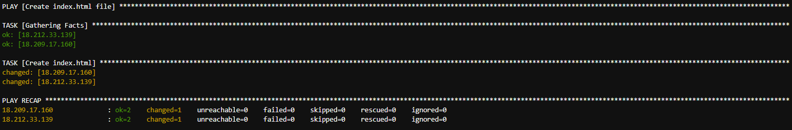

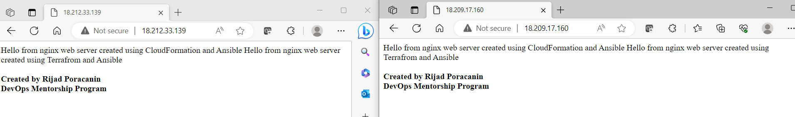
