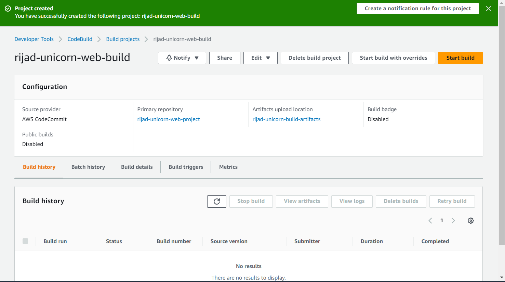

# TASK - 13: AWS Code Family Workshop

https://catalog.us-east-1.prod.workshops.aws/workshops/752fd04a-f7c3-49a0-a9a0-c9b5ed40061b/en-US

- In this workshop we will explore the AWS DevOps tooling to build and deploy a simple Java web application.

We will use AWS CodeCommit as a Git repository to store our code and AWS CodeArtifact to manage software packages. We will use AWS CodeBuild to compile the Java application, and AWS CodeDeploy to deploy the application to an EC2 web server. AWS CodePipeline will help orchestrate the whole process.


## Environment Setup

- I created Cloud9 environment with Amazon Linux 2 instance.
- Apache Maven is a build automation tool used for Java projects. In this workshop we will use Maven to help initialize our sample application and package it into a Web Application Archive (WAR) file.
- I have installed Apache Maven using commands below:
```shell
sudo wget https://repos.fedorapeople.org/repos/dchen/apache-maven/epel-apache-maven.repo -O /etc/yum.repos.d/epel-apache-maven.repo
sudo sed -i s/\$releasever/6/g /etc/yum.repos.d/epel-apache-maven.repo
sudo yum install -y apache-maven
```


- Maven comes with Java 7. For the build image that we're going to use later on we will need to use at least Java 8. Therefore we are going to install Java 8, or more specifically Amazon Correto 8 , which is a free, production-ready distribution of the Open Java Development Kit (OpenJDK) provided by Amazon:

```shell
sudo amazon-linux-extras enable corretto8
sudo yum install -y java-1.8.0-amazon-corretto-devel
export JAVA_HOME=/usr/lib/jvm/java-1.8.0-amazon-corretto.x86_64
export PATH=/usr/lib/jvm/java-1.8.0-amazon-corretto.x86_64/jre/bin/:$PATH
```


- Now, we want to create application. So, I'm using mvn to generate a sample java web app.
```
mvn archetype:generate \
    -DgroupId=com.wildrydes.app \
    -DartifactId=unicorn-web-project \
    -DarchetypeArtifactId=maven-archetype-webapp \
    -DinteractiveMode=false
```


## Lab 1: AWS CodeCommit

- Through AWS CodeCommit, I created repository, then I push my code from Cloud9 environment to this new repository.
```shell
git config --global user.name "rijadp"
git config --global user.email rijadporacanin@gmail.com

cd ~/environment/unicorn-web-project
git init -b main
git remote add origin https://git-codecommit.us-east-1.amazonaws.com/v1/repos/rijad-unicorn-web-project

git add *
git commit -m "Initial commit"
git push -u origin main
```


## Lab 2: AWS CodeArtifact

- AWS CodeArtifact is a fully managed artifact repository service that makes it easy for organizations of any size to securely fetch, store, publish, and share software packages used in their software development process.

In this lab we will setup a CodeArtifact repository that we will be using during the build phase with CodeBuild to fetch Maven packages from a public package repository (the "Maven Central Repository"). Using CodeArtifact rather than the public repository directly has several advantages, including improved security, as you can strictly define which packages can be used. To see other advantages of using CodeArtifact, please refer to the AWS CodeArtifact features  web page.

Within this workshop, we will use CodeArtifact as a simple package cache. This way, even if the public package repository would become unavailable, we could still build our application. In real-world scenarios this can be an important requirement to mitigate the risk that an outage of the public repository can break the complete CI/CD pipeline. Furthermore, it helps to ensure that packages, which your project depends on, and which are (accidentally, or on purpose) being removed from the public package repository, don't break the CI/CD pipeline (as they are still available via CodeArtifact in that case).

- Through AWS CodeArtifact service I created domain *unicorns* and I created repository *unicorn-packages* with **maven-central-store** as a public upstream.
- Then, through Cloud9 I connected to the CodeArtifact repository using connection instructions.


- Then I compiled the application using the settings file and command:
```shell
mvn -s settings.xml compile
```


- I define an IAM policy so that other services can consume our newly created CodeArtifact repository. I used JSON code from below:
```json
{
  "Version": "2012-10-17",
  "Statement": [
      {
          "Effect": "Allow",
          "Action": [ "codeartifact:GetAuthorizationToken",
                      "codeartifact:GetRepositoryEndpoint",
                      "codeartifact:ReadFromRepository"
                      ],
          "Resource": "*"
      },
      {       
          "Effect": "Allow",
          "Action": "sts:GetServiceBearerToken",
          "Resource": "*",
          "Condition": {
              "StringEquals": {
                  "sts:AWSServiceName": "codeartifact.amazonaws.com"
              }
          }
      }
  ]
}
```

## Lab 3: AWS CodeBuild

- AWS CodeBuild is a fully managed continuous integration service that compiles source code, runs tests, and produces software packages that are ready to deploy. You can get started quickly with prepackaged build environments, or you can create custom build environments that use your own build tools.

In this lab we will setup a CodeBuild project to package our application code into a Java Web Application Archive (WAR) file.

- I have created CodeBuild project



- Now we have our build project setup we need to give it some instructions on how to build our application. To do this we will create a buildspec.yml file
```yaml
version: 0.2

phases:
  install:
    runtime-versions:
      java: corretto17
  pre_build:
    commands:
      - echo Initializing environment
      - export CODEARTIFACT_AUTH_TOKEN=`aws codeartifact get-authorization-token --domain unicorns --domain-owner 723991093784 --query authorizationToken --output text`
  build:
    commands:
      - echo Build started on `date`
      - mvn -s settings.xml compile
  post_build:
    commands:
      - echo Build completed on `date`
      - mvn -s settings.xml package
artifacts:
  files:
    - target/unicorn-web-project.war
  discard-paths: no
```

- I modified auto-generated IAM role 'codebuild-unicorn-web-build-service-role' and added permissions to this role attaching 'codeartifact-unicorn-consumer-policy' policy.


- Then I tested the build project by clicking on the 'Start build' button, inside CodeBuild service.


## Lab 4: AWS CodeDeploy

- AWS CodeDeploy is a fully managed deployment service that automates software deployments to a variety of compute services such as Amazon EC2, AWS Fargate, AWS Lambda, and even on-premise services. You can use AWS CodeDeploy to automate software deployments, eliminating the need for error-prone manual operations.

In this lab, we will use CodeDeploy to install our Java WAR package onto an Amazon EC2 instance running Apache Tomcat.

- I have created an EC2 instance using CloudFormation.
- Next, I have created some bash scripts in my Git repository. CodeDeploy uses these scripts to setup and deploy the application on the target EC2 instance.

*install_dependencies.sh*
```bash
#!/bin/bash
sudo yum install tomcat -y
sudo yum -y install httpd
sudo cat << EOF > /etc/httpd/conf.d/tomcat_manager.conf
<VirtualHost *:80>
    ServerAdmin root@localhost
    ServerName app.wildrydes.com
    DefaultType text/html
    ProxyRequests off
    ProxyPreserveHost On
    ProxyPass / http://localhost:8080/unicorn-web-project/
    ProxyPassReverse / http://localhost:8080/unicorn-web-project/
</VirtualHost>
EOF
```

*start_server.sh*
```bash
#!/bin/bash
sudo systemctl start tomcat.service
sudo systemctl enable tomcat.service
sudo systemctl start httpd.service
sudo systemctl enable httpd.service
```

*stop_server.sh*
```bash
#!/bin/bash
isExistApp="$(pgrep httpd)"
if [[ -n $isExistApp ]]; then
sudo systemctl stop httpd.service
fi
isExistApp="$(pgrep tomcat)"
if [[ -n $isExistApp ]]; then
sudo systemctl stop tomcat.service
fi
```

- CodeDeploy uses an application specification (AppSpec) file in YAML to specify what actions to take during a deployment, and to define which files from the source are placed where at the target destination. The AppSpec file must be named appspec.yml and placed in the root directory of the source code.

```yaml
version: 0.0
os: linux
files:
  - source: /target/unicorn-web-project.war
    destination: /usr/share/tomcat/webapps/
hooks:
  BeforeInstall:
    - location: scripts/install_dependencies.sh
      timeout: 300
      runas: root
  ApplicationStart:
    - location: scripts/start_server.sh
      timeout: 300
      runas: root
  ApplicationStop:
    - location: scripts/stop_server.sh
      timeout: 300
      runas: root
```

- I modified the artifacts section in the buildspec.yml like shown below:

```yaml
artifacts:
  files:
    - target/unicorn-web-project.war
    - appspec.yml
    - scripts/**/*
  discard-paths: no
  ```

- And then commit all the changes to CodeCommit and created IAM role for CodeDeploy service.


- CodeDeploy application:


- Deployment group:


- Deployment created:


## Lab 5: AWS CodePipeline

- AWS CodePipeline is a fully managed continuous delivery service that helps you automate your release pipelines for fast and reliable application and infrastructure updates. You only pay for what you use.

In this lab we use CodePipeline to create an automated pipeline using the CodeCommit, CodeBuild and CodeDeploy components created earlier. The pipeline will be triggered when a new commit is pushed to the main branch of our Git repo.


- Now I have a fully managed CI/CD pipeline! Let's test if everything is working.
- I have changed html code inside index.jsp file and I pushed these changes to the CodeCommit repository. The pipeline was triggered by the push automatically and pipeline completed successfully.


## Extending the pipeline

- In this lab we will look at extending our existing CodePipeline to include a manual approval step before deploying to a production server.

- I have updated CloudFormation template, and then added additional CodeDeploy deployment group.


- SNS topic


- The, I updated CodePipeline with additional stages.


- I tested this by clicking on Release changes and wait for the pipeline to reach the manual approval stage and then I received an email with an approval link.


- When I approved, it proceed to the next stage production CodeDeploy and completed successfully.


