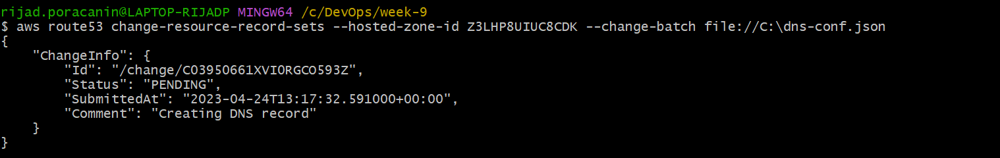
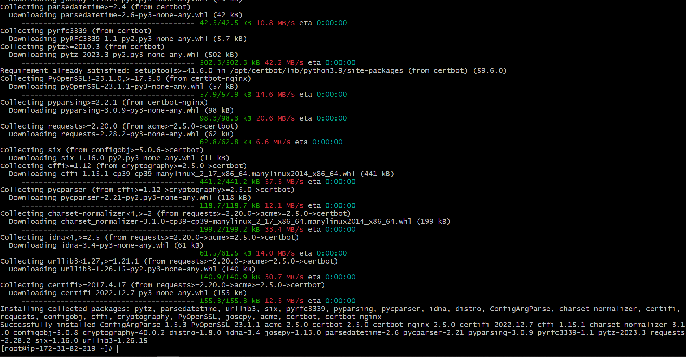
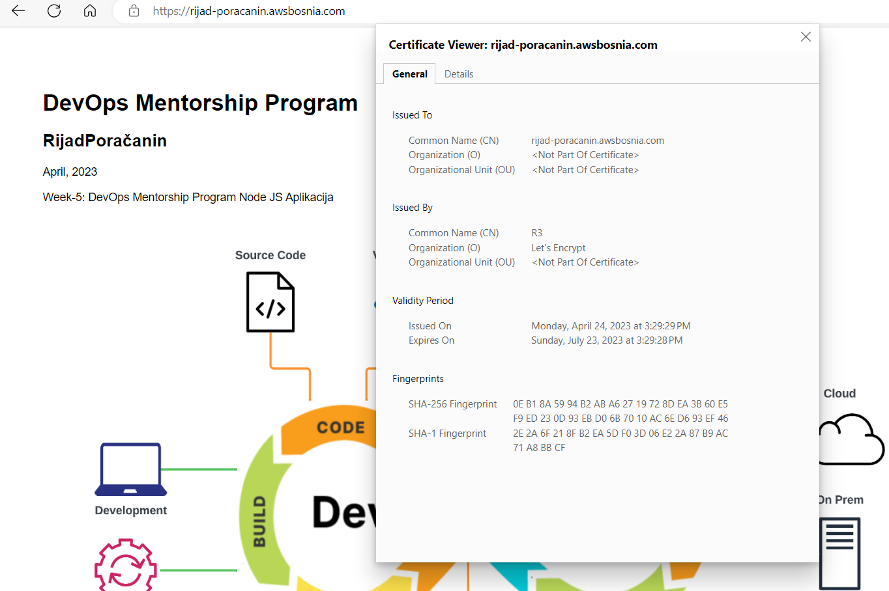
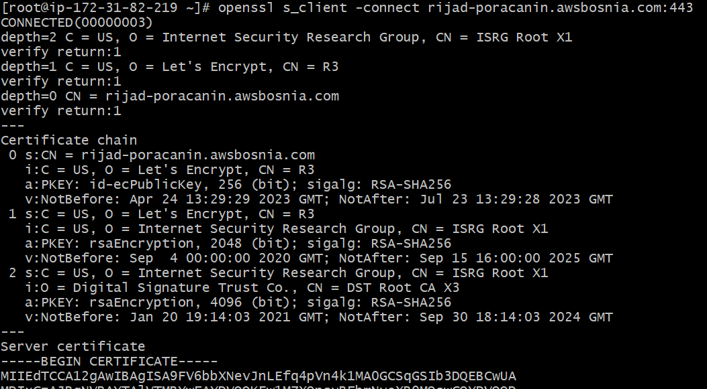
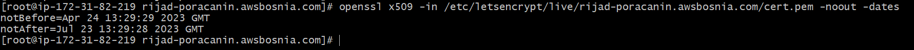
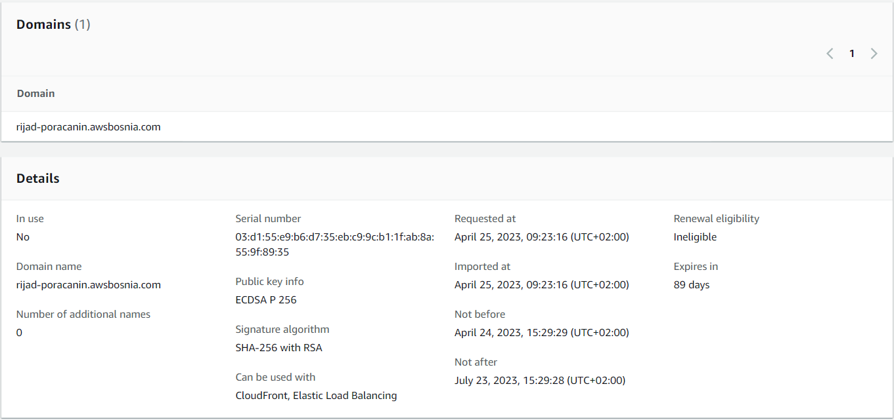
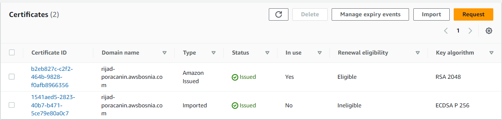
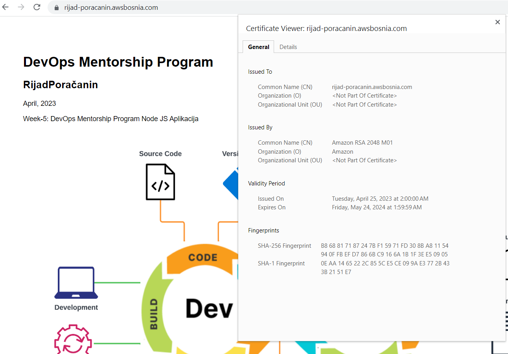

# TASK-8: Implement SSL Let's Encrypt, migrate to AWS ACM 

* [ ]  Od postojeceg AMI image sam kreirao EC2 instancu `ec2-rijad-poracanin-task-8`

* [ ]  Za kreiranje DNS Recorda rijad-poracanin.awsbosnia.com sam koristio sljedece komande:

``
aws configure --profile aws-bosnia
``

``aws route53 change-resource-record-sets --hosted-zone-id Z3LHP8UIUC8CDK --change-batch file://C:\dns-conf.json``

gdje je sadržaj dns-conf.json fajla:

```
{
            "Comment": "Creating DNS record",
            "Changes": [{
            "Action": "CREATE",
                        "ResourceRecordSet": {
                                    "Name": "rijad-poracanin.awsbosnia.com",
                                    "Type": "A",
                                    "TTL": 60,
                                 "ResourceRecords": [{ "Value": "3.87.247.142"}]
}}]
}
```




* [ ] Za kreiranje Let's Encrypt certifikata sam pratio instrukcije sa [linka](https://certbot.eff.org/instructions?ws=nginx&os=pip), a to su sljedeće komande:

`sudo dnf install python3 augeas-libs`

`sudo python3 -m venv /opt/certbot/`

`sudo /opt/certbot/bin/pip install --upgrade pip`

`sudo certbot certonly --nginx`






* [ ] Autorenewal sam omogućio koristeći komandu:

`echo "0 0,12 * * * root /opt/certbot/bin/python -c 'import random; import time; time.sleep(random.random() * 3600)' && sudo certbot renew -q" | sudo tee -a /etc/crontab > /dev/null`


* [ ] Openssl komanda za detaljni pregled certifikata:

`openssl s_client -connect rijad-poracanin.awsbosnia.com:443`

Za prikazivanje detalja certifikata spremljenog u lokalnoj datoteci

`openssl x509 -in /etc/letsencrypt/live/rijad-poracanin.awsbosnia.com/cert.pem -noout -text`



Prikazivanje datuma:

`openssl x509 -in /etc/letsencrypt/live/rijad-poracanin.awsbosnia.com/cert.pem -noout -dates`



* [ ] Importovao sam Lets Encrypt certtifikat unutar AWS Certificate Managera.



* [ ] Kreirao Load Balancer i dodijelio mu Target grupu u kojoj se nalazi moj web server.
* [ ] Kreirao novi SSL certifikat unutar AWS Certificate Managera, podesio da Load Balancer koristi novi SSL certifikat, stari uklonio.
Uklonio DNS zapis 'rijad-poracanin.awsbosnia.com' koji je pokazivao na IP adresu moje EC2 instance, a kreirao novi DNS zapis koji pokazuje na DNS ime mog Load balancera.




* [ ] Na kraju napravio AMI image od EC2 instance koju smo koristili, pod nazivom 'ami-ec2-rijad-poracanin-task-8', i terminirao resurse.
